# 从零实现 Coding Agent Harness：以 Corki 为源码教材

> 这不是 Corki 的使用手册，而是一份面向计算机专业学生的实现教材。全文围绕 Agent Harness
> 的五个核心组件展开：Planning & Reasoning、Memory、Tool Use、Context Engineering 和
> State Management。目标是让你读完后能独立设计并实现一个可测试、可恢复、可扩展的 Coding Agent。

## 导读：怎样学习这篇文章

### 学习目标

读完并完成练习后，你应该能够：

1. 解释“大模型 API”与“Agent Harness”的区别；
2. 用 LangGraph 写出 `模型 -> 工具 -> 观察 -> 模型` 的循环；
3. 实现显式计划、thinking 流、确定性路由和循环上限；
4. 实现短期历史、工作记忆、上下文压缩和跨 Thread 长期记忆；
5. 定义、暴露、选择、执行工具，并将结果可靠地送回模型；
6. 动态组装 prompt、项目规则、工具 schema、skills 和检索内容；
7. 使用 checkpoint 与业务账本恢复被中断的 Turn；
8. 将 OpenAI/DeepSeek 流式协议隔离在 provider adapter；
9. 通过 unit、integration 和故障注入测试证明 Harness 的核心不变量。

### 五个组件不是五座孤岛

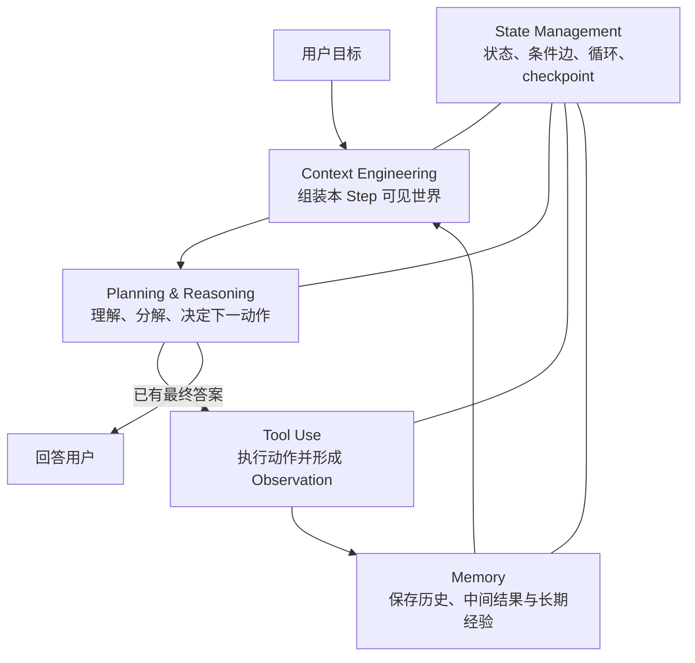

五个组件的边界如下：

| 组件 | 核心问题 | Corki 的关键代码 |
| --- | --- | --- |
| Planning & Reasoning | 下一步做什么，计划是否需要调整 | `planning/`、`evaluation/`、`ReasoningItem` |
| Memory | 哪些过去和中间状态应被保留、怎样召回 | `protocol/items.py`、`context/history.py`、`memory/` |
| Tool Use | 模型能调用什么，怎样执行并返回 Observation | `protocol/tools.py`、`tools/`、graph tool node |
| Context Engineering | 下一次模型请求究竟看见什么 | `prompting/`、`context/`、skills/memory contributors |
| State Management | Agent 运行到哪里，如何循环、并行、恢复 | `core/state.py`、`core/graph.py`、`core/runtime.py`、storage |

Evaluation、预算和协议校验是横切约束，不单独列为第六个组件。CLI、Provider adapter、Skills、MCP、
Plugin 也不是另一套主循环，而是围绕这五个组件工作的输入、输出或扩展适配器。

### 推荐阅读方式

每个核心章节都按同一结构组织：

1. **概念边界**：先知道它负责什么、不负责什么；
2. **源码地图**：知道真实实现分布在哪里；
3. **核心代码**：逐段解释输入、输出、副作用和故障边界；
4. **贯穿案例**：跟踪 state、history、事件和模型请求；
5. **自己实现**：给出最小代码骨架和实现顺序；
6. **测试验收**：不用真实模型也能证明实现正确。

文中的“核心摘录”会为教学省略 imports、日志和旁支，不能当作独立文件；明确写出文件名并标注
“可运行”的代码块才要求原样执行；使用 `completed(...)` 等 test helper 的块会明确标成伪代码。真实
行为以链接指向的 Corki 源码为准。

## 目录

1. [项目背景与总体架构](#一项目背景与总体架构)
2. [Planning & Reasoning](#二planning--reasoning规划与推理)
3. [Memory](#三memory记忆系统)
4. [Tool Use](#四tool-use工具使用)
5. [Context Engineering](#五context-engineering上下文工程)
6. [State Management](#六state-management状态管理)
7. [五大组件怎样协作完成一个任务](#七五大组件怎样协作完成一个任务)
8. [Provider 流式协议与 RuntimeEvent](#八provider-流式协议与-runtimeevent)
9. [Skills、MCP 与 Plugin](#九skillsmcp-与-plugin)
10. [从零实现路线与测试](#十从零实现路线与测试)
11. [总结与源码阅读地图](#十一总结与源码阅读地图)

---

## 一、项目背景与总体架构

### 1.1 为什么调用模型还不等于 Agent

一次普通模型调用近似是：

```python
answer = await model.generate(system_prompt, user_text)
```

它没有项目目录、不能运行命令、不知道工具结果、进程退出后忘记一切，也无法判断应该继续还是完成。
Harness 是包围模型的确定性软件层，它负责：

```text
输入治理 -> 上下文构建 -> 模型采样 -> 输出解析 -> 路由
        -> 工具执行 -> Observation -> 再次采样 -> 持久化/恢复 -> 事件输出
```

模型负责在不完全信息下做语义判断；Harness 负责协议、状态、副作用、资源边界和生命周期。成熟 Agent
的关键不是一个巨大的 prompt，而是让非确定性模型运行在可验证的确定性框架中。

### 1.2 Corki 的核心目标和技术栈

Corki 用 Python 与 LangGraph 实现 Codex 风格的 Coding Agent 核心。当前重点是核心 Harness，而不是
sandbox、审批和多 Agent。主要技术：

> **教学安全范围**：本文为了突出 Harness，暂不实现 sandbox 与审批，因此示例只能在临时目录、无
> secrets 的测试仓库中运行。Shell 必须有 timeout 和输出上限；文件路径必须规范化；模型/MCP 输出
> 一律视为不可信；Python Plugin 等同本地任意代码。没有这些边界的教学实现不能直接用于生产仓库。

| 技术 | 用途 |
| --- | --- |
| Python 3.11+ / `asyncio` | 模型流、工具、MCP、事件和取消 |
| LangGraph | 显式节点、条件边、循环和 checkpoint |
| SQLite | Thread/Turn/history/账本与 LangGraph checkpoint |
| `httpx` | OpenAI-compatible/Responses 流式 HTTP |
| dataclass / TypedDict / Protocol | canonical 数据、state 和依赖倒置 |
| JSON Schema | 工具参数和结构化模型输出 |
| prompt-toolkit / Rich | CLI 输入和 RuntimeEvent 渲染 |

### 1.3 三层分离：事实、能力、展示

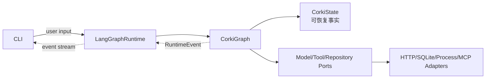

- **事实**：`CorkiState`、`ConversationItem`、`ToolCall`，能够序列化；
- **能力**：HTTP client、SQLite connection、Tool handler、Process manager，通过依赖注入提供；
- **展示**：CLI 只消费 `RuntimeEvent`，核心代码不直接打印。

这条边界决定了 checkpoint 能否恢复、provider 能否替换、测试能否使用 fake、未来 Web UI 是否需要
重写核心。

### 1.4 Canonical Item：五个组件共同的数据语言

[`protocol/items.py`](src/corki/protocol/items.py) 定义 provider-neutral 的对话事实：

```text
UserMessageItem       用户输入
AssistantMessageItem  模型最终正文
ReasoningItem         thinking/summary/provider opaque reasoning
ToolCallItem          模型请求的 Action
ToolResultItem        工具 Observation 与显式 state update
ContextItem           项目、环境、skills、memory 等 world state
CompactionItem        替代旧窗口的摘要 checkpoint
```

为什么不能直接存 OpenAI `messages`？因为 Chat Completions 使用 role/tool_calls，Responses 使用
input item/function_call_output，DeepSeek 又有 reasoning replay。先转成 canonical item，Memory、Context、
State 和 Tool Use 才不会被某个供应商的数据结构绑死。

### 1.5 六节点是五个组件的执行骨架

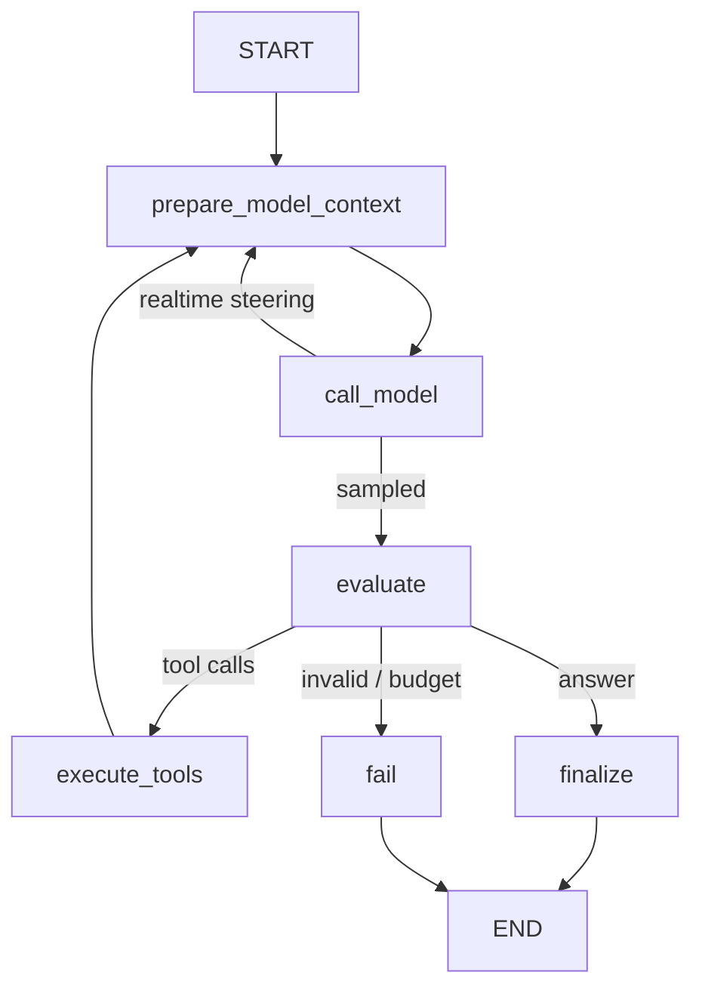

- Context Engineering 主要发生在 `prepare_model_context`；
- Planning & Reasoning 由模型、planning tool 和 `evaluate` 共同承载；
- Tool Use 发生在 model/tool canonical 协议和 `execute_tools`；
- Memory 为 prepare 提供 history，又接收 model/tool 结果；
- State Management 用整个 StateGraph、Runtime 和 checkpoint 把它们组织起来。

接下来不按目录逐文件介绍，而按这五种能力逐一拆解。

---

## 二、Planning & Reasoning（规划与推理）

### 2.1 概念边界：计划、推理、路由、反思不是一件事

| 概念 | 含义 | 谁消费 | Corki 当前实现 |
| --- | --- | --- | --- |
| Planning | 把目标拆成可追踪步骤 | 用户与 Agent | `update_plan` 工具 + `state.plan` |
| Reasoning | 模型形成下一动作的内部推理 | 模型与可选 UI | `ReasoningItem` + reasoning delta |
| Routing | 决定下一条 StateGraph 边 | Harness | `evaluate_model_step` 纯规则 |
| Reflection | 读 Observation 后修正假设或计划 | 模型 | 工具闭环中再次采样，可再次 `update_plan` |

Chain-of-Thought 是模型内部的逐步推理方式，Tree-of-Thoughts 是探索多条候选推理分支的策略，ReAct
是 `Thought -> Action -> Observation` 循环。Corki 支持 reasoning 流和 ReAct 式工具循环，但当前没有
实现显式 ToT 搜索器，也没有单独的 reflection 节点。不要把“模型可能自我反思”误写成 Harness 已
实现了一套可验证的 ToT 算法。

更重要的是：**模型决定语义动作，Harness 决定动作是否合法以及图往哪里走。** 模型可以建议调用
工具或给出正文，但不能通过输出任意 `next_node` 控制程序。

### 2.2 源码地图

```text
prompts/agent/base.md                何时创建/更新 plan 的行为指导
src/corki/planning/models.py         PlanItem、PlanStatus、validate_plan
src/corki/tools/builtin/plan.py      update_plan 工具定义与执行
src/corki/protocol/items.py          ReasoningItem
src/corki/models/*.py                provider reasoning -> ModelReasoningDelta
src/corki/evaluation/guards.py       确定性下一步路由
src/corki/core/graph.py              call_model/evaluate/tool loop
```

### 2.3 任务分解怎样进入显式工作状态

基础 prompt 没有要求所有问题都建计划。简单问答创建计划只会增加工具调用；多文件修改、长调查或有
依赖的任务才值得用 plan。模型决定需要计划后，会生成普通 ToolCall：

```json
{
  "name": "update_plan",
  "arguments": {
    "explanation": "先定位调用链，再修复并验证。",
    "plan": [
      {"step": "读取入口和失败测试", "status": "in_progress"},
      {"step": "修复根因", "status": "pending"},
      {"step": "运行回归测试", "status": "pending"}
    ]
  }
}
```

[`UpdatePlanTool`](src/corki/tools/builtin/plan.py) 的 schema 与 handler 绑定。以下是核心摘录，
`item_schema` 是同一 `spec` 属性前半段定义的 plan item schema：

```python
class UpdatePlanTool:
    @property
    def spec(self) -> ToolSpec:
        return ToolSpec(
            name="update_plan",
            description="Update the user-visible task plan. "
                        "At most one step may be in_progress.",
            parameters={
                "type": "object",
                "properties": {
                    "plan": {"type": "array", "items": item_schema, "minItems": 1},
                    "explanation": {"type": "string"},
                },
                "required": ["plan"],
                "additionalProperties": False,
            },
        )
```

执行时不是把 plan 当文本返回，而是产生显式 state update：

```python
async def execute(self, call: ToolCall, context: ToolContext) -> ToolResult:
    plan = validate_plan(call.arguments["plan"])
    rendered = tuple(item.as_dict() for item in plan)
    return ToolResult(
        call.id,
        call.name,
        call.arguments.get("explanation") or "Plan updated.",
        state_update=ToolStateUpdate(plan=rendered),
    )
```

`validate_plan()` 逐项检查非空 step、合法 status，并强制最多一个 `in_progress`：

```python
active_count = sum(item.status is PlanStatus.IN_PROGRESS for item in items)
if active_count > 1:
    raise ValueError("at most one plan item may be in_progress")
```

这个约束使 plan 成为“受约束的当前快照”，而不是任意 Markdown：

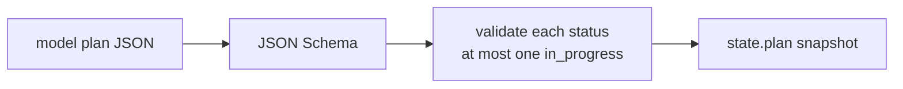

当前 `validate_plan()` 不读取旧 plan，也不校验 `completed -> pending` 等跨快照转移。若产品需要严格
计划状态机，应给步骤增加稳定 ID，并实现 `validate_transition(old_plan, new_plan)`；不要把当前快照
校验描述成源码尚未实现的转移规则。

Tool 节点读取 `ToolResult.state_update.plan`，写入 `CorkiState.plan` 并发出 `PlanUpdated`。因此：

```text
模型建议计划 -> schema/业务校验 -> ToolStateUpdate -> graph state -> RuntimeEvent -> UI
```

UI 不解析模型自然语言，graph 也不依赖 Rich 控件。

### 2.4 Reasoning/thinking 的数据流

DeepSeek Chat 流可能返回 `delta.reasoning_content`，OpenAI Responses 可能返回 reasoning summary 与
opaque/encrypted state。Provider adapter 统一转换为：

```python
@dataclass(frozen=True, slots=True)
class ReasoningItem:
    content: str
    turn_id: TurnId
    step_id: ModelStepId
    summary: str | None = None
    provider_name: str | None = None
    provider_item_id: str | None = None
    encrypted_content: str | None = None
```

流式阶段，graph 将模型事件转为 UI 协议：

```python
if isinstance(event, ModelReasoningDelta):
    await runtime.context.events.emit(
        AssistantReasoningDelta(thread_id, turn_id, event.delta)
    )
```

最终 `ReasoningItem` 与同一模型响应的 assistant/tool-call items 共享 `step_id`。某些 provider 要求工具
续接时 replay reasoning，adapter 根据 capability 原样发回；其他 provider 不需要。Reasoning 可以提升
复杂任务表现，也有助于显示“正在思考”，但业务路由不能依赖解析它的自然语言。

### 2.5 路由选择：模型选择动作，程序选择边

模型一次 Step 只能给 Harness 三类可执行信号：tool call、assistant text、无效输出。Corki 的
[`evaluate_model_step`](src/corki/evaluation/guards.py) 将它们映射为固定枚举：

```python
tool_calls = tuple(item.call for item in items if isinstance(item, ToolCallItem))
has_text = any(
    isinstance(item, AssistantMessageItem) and item.content.strip()
    for item in items
)
if step_count > max_steps or (tool_calls and step_count >= max_steps):
    return StepEvaluation(FAIL, "model step limit exceeded")
if tool_calls:
    if tool_call_count + len(tool_calls) > max_tool_calls:
        return StepEvaluation(FAIL, "tool call limit exceeded")
    if duplicate_call_ids(tool_calls):
        return StepEvaluation(FAIL, "duplicate tool call ids")
    return StepEvaluation(EXECUTE_TOOLS)
if has_text:
    return StepEvaluation(FINALIZE)
return StepEvaluation(FAIL, "model returned neither text nor tool calls")
```

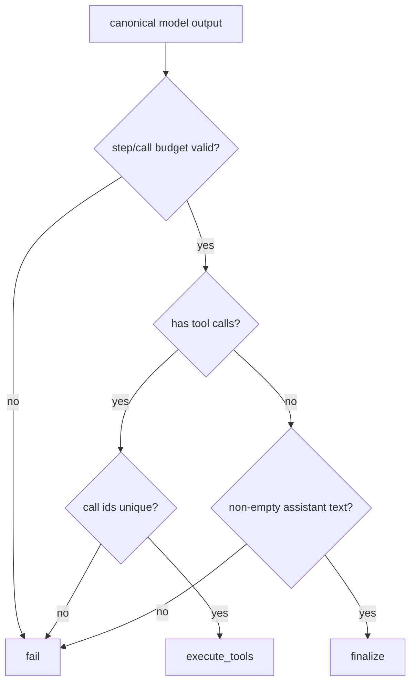

这里没有关键词分类器。用户说“修复登录 bug”后具体先读文件还是跑测试，是模型根据 prompt、history
和 ToolSpec 做的语义选择；Harness 只对结果执行确定性分类。

### 2.6 自我反思怎样发生：Observation 驱动下一次采样

假设任务是“修复解析器失败并跑测试”：

```text
Step 0 reasoning: 先定位失败测试
Action: update_plan([...])
Observation: Plan updated

Step 1 reasoning: 读取测试和解析器
Action: exec_command("rg ... && sed ...")
Observation: 实际源码与错误输出

Step 2 reasoning: 原假设不成立，问题是 terminal packet 判断
Action: update_plan(将“修 schema”改成“修 terminal 处理”)
Observation: Plan updated

Step 3 Action: apply_patch(...)
Observation: patch applied

Step 4 Action: exec_command("pytest ...")
Observation: 12 passed

Step 5 answer: 解释根因、改动和验证结果
```

反思不是 Harness 神秘调用了一个 `reflect()`。工具结果作为 `ToolResultItem` 持久化，图回到
`prepare_model_context`，下一次模型看见 Observation 后重新推理，并可通过 `update_plan` 显式调整。
这就是 Corki 当前的 ReAct 闭环。

### 2.7 从零实现这一组件

实现顺序：

1. 定义 `PlanStatus`、`PlanItem` 和 `validate_plan`，先写纯函数测试；
2. 定义 `ToolStateUpdate(plan=...)`，让 planning 使用普通工具协议；
3. 在 Agent state 增加 `plan`，Tool 节点只接受显式 state update；
4. 定义 `EvaluationDecision` 与纯 `evaluate_model_step`；
5. 在 StateGraph 添加条件边和 step/tool-call 上限；
6. Provider adapter 将 reasoning delta/item 转成 canonical 类型；
7. RuntimeEvent 分离 reasoning、plan 与正文展示。

不要一开始实现 ToT。先证明一个受限 ReAct 循环能够：创建计划、观察结果、调整计划、停止循环。

### 2.8 测试与检查点

至少测试：

- 空计划、非法 status、两个 `in_progress` 被拒绝；
- planning tool 返回 `ToolStateUpdate`，graph 更新 plan 并发出事件；
- 有 tool call 即路由工具，即使同 Step 同时带正文；
- 无 call 有正文才 finalize；空输出、重复 call id、预算超限 fail；
- reasoning delta 与正文 delta 分离；opaque reasoning round-trip 后不损坏；
- FakeModel 根据第一次 Observation 第二次更新计划，证明反思闭环确实存在。

> **本章检查点**：你应能解释“任务分解由谁提出、由谁校验、保存在哪里、UI 怎样得知”；还能说明
> 模型选择 Action 与 Harness 选择 Graph edge 为什么必须分开。

---

## 三、Memory（记忆系统）

### 3.1 概念边界：短期、工作、长期记忆

| 类型 | 生命周期 | 保存什么 | Corki 对应实现 |
| --- | --- | --- | --- |
| 短期记忆 | 当前 Thread/模型窗口 | 连续对话、工具 call/result、压缩摘要 | canonical history + `active_history()` |
| 工作记忆 | 当前 Turn/执行图 | plan、pending input、计数器、最后模型输出 | `CorkiState` + checkpoint |
| 长期记忆 | 跨 Thread | 稳定偏好、仓库约定、可靠命令、可复用经验 | `memory/` 两阶段 pipeline + memory artifacts |

Context 与 Memory 有交集但不等价：Memory 决定哪些事实能够跨 Step/Turn/Thread 存在；Context
Engineering 决定下一次请求从这些事实中拿哪些、怎样排列、如何放进 token 预算。

长期记忆常用 Vector DB 做 embedding 检索，但“长期记忆 = Vector DB”不是定义。Corki 当前参考 Codex
风格，使用模型两阶段提炼、SQLite job 治理、`memory_summary.md` 路由和 `MEMORY.md`/rollout 文件按需
搜索，没有向量数据库。它适合本地、可读、可编辑的小型 Agent 经验库；若以后接入向量库，应实现为
新的 retrieval adapter，而不是替换 canonical history。

### 3.2 源码地图

```text
src/corki/protocol/items.py        短期历史的 canonical items
src/corki/context/history.py       active view、tool pair 修复
src/corki/core/state.py            工作记忆
src/corki/sessions/repository.py   历史与 Turn 的存储 port
src/corki/storage/sqlite.py        SQLite 业务事实
src/corki/memory/pipeline.py       长期记忆 Phase 1/2
src/corki/memory/sqlite.py         claim/lease/watermark
src/corki/memory/context.py        每轮注入小型 summary
src/corki/memory/backend.py        list/read/search/add-note
src/corki/memory/artifacts.py      MEMORY.md 等文件发布
```

### 3.3 短期记忆：append-only history 与 active view

同一 Thread 中，用户消息、模型响应、reasoning、工具调用和结果都被 append 到
`conversation_items`。模型下一 Step 不是只看“最后一句”，而是看 `active_history()` 生成的连续窗口。

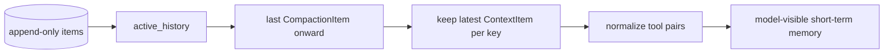

[`active_history`](src/corki/context/history.py) 的两个关键规则：

```python
def active_history(items):
    start = last_compaction_index(items)
    window = reconstruct_compaction_replacement(items[start:])
    latest_context = {
        item.key: index
        for index, item in enumerate(window)
        if isinstance(item, ContextItem)
    }
    current = tuple(
        item for index, item in enumerate(window)
        if not isinstance(item, ContextItem)
        or (latest_context[item.key] == index and bool(item.content))
    )
    return normalize_tool_pairs(current)
```

一是每个 context key 只保留最后版本，空内容代表 tombstone；二是修复工具关系：孤立 result 删除，
缺少 result 的 call 插入稳定 ID 的 `aborted` 结果。这样崩溃后的历史仍满足 provider 的工具协议。

#### 例子：连续两轮为什么能记住变量

```text
Turn 1 user: 项目代号叫 Aurora
Turn 1 assistant: 好的
Turn 2 user: 项目代号是什么？
```

Turn 2 的 `prepare_model_context` 从 repository 读取同一 Thread 的 items，active view 仍包含 Turn 1，
所以模型能回答 Aurora。这不是长期记忆检索；换一个新 Thread 后，这段原始对话不会整段注入。

### 3.4 工作记忆：当前任务正在发生什么

[`CorkiState`](src/corki/core/state.py) 是工作记忆：

```python
class CorkiState(TypedDict):
    thread_id: ThreadId
    turn_id: TurnId
    user_input: str
    request_items: tuple[ConversationItem, ...]
    request_tools: tuple[ToolSpec, ...]
    pending_input_items: tuple[UserMessageItem, ...]
    last_model_items: tuple[ConversationItem, ...]
    plan: tuple[dict[str, str], ...]
    step_count: int
    tool_call_count: int
    route: str
    status: str
    final_answer: str | None
    error: str | None
```

例如 `last_model_items` 让 evaluate 知道本 Step 是否产生 tool calls；`request_tools` 让执行阶段知道模型
当时获知的候选工具；`plan` 让后续工具 Step 与 UI 共享任务进度。它们不是“聊天内容”，却是恢复执行
必须具备的临时变量，因此由 LangGraph checkpoint 保存。

HTTP client、SQLite connection、ToolRegistry 和 subprocess handle 不是工作记忆。它们是当前进程的
能力对象，跨进程不能稳定解释，必须由 Runtime 重建。

### 3.5 上下文压缩：短期记忆超窗时怎样保留任务

[`ContextWindowManager`](src/corki/context/window.py) 在总请求估算达到自动阈值时压缩旧历史：

```text
选择旧的 compactable items
 -> 在 item 边界分块，不拆 tool call/result
 -> 模型分别生成摘要
 -> 必要时递归合并摘要，最多四层
 -> append CompactionItem + replacement
 -> 重新估算并检查硬窗口
```

当前 pending 用户输入和 ContextItem 不交给摘要模型改写：

```python
protected_ids = ids_of_current_pending_input
compactable = tuple(
    item for item in historical
    if not isinstance(item, ContextItem) and item.id not in protected_ids
)
summary = await self._summarize(compactable, depth=0)
checkpoint = CompactionItem(summary, all_items[-1].id, turn_id)
await repository.append_items(
    thread_id, (checkpoint, *reinjected_context, *pending_user)
)
```

物理数据库不删除旧行，`CompactionItem` 只改变模型可见 view。这保留审计能力，也使一次事务可以写入
完整 marker/replacement，避免半份压缩状态。

### 3.6 长期记忆 Phase 1：从单个 Thread 提炼

长期 pipeline 不阻塞用户 Turn。Runtime 启动后，`LongTermMemoryService` 在后台领取少量满足 idle、
年龄和 memory mode 条件的已完成 Thread：

```python
claims = await repository.claim_extraction_jobs(
    current_thread_id=current_thread_id,
    max_age_days=settings.memories_max_thread_age_days,
    min_idle_hours=settings.memories_min_thread_idle_hours,
    limit=settings.memories_max_threads_per_startup,
    lease_seconds=settings.memories_lease_seconds,
)
```

每个 claim 包含 `thread_id/cwd/source_updated_at/ownership_token/items`。模型将 canonical transcript
提炼成结构化结果：

```json
{
  "raw_memory": "用户偏好使用 pytest；该仓库回归命令是 uv run pytest -q",
  "rollout_summary": "确定了测试偏好与回归命令",
  "rollout_slug": "pytest-workflow"
}
```

普通闲聊、未经验证的猜测、容易从当前仓库重新读取的临时状态应丢弃。输出经过 JSON key/type 校验
和 secret redaction 后才能提交。

#### 为什么需要 claim、lease 和 source version

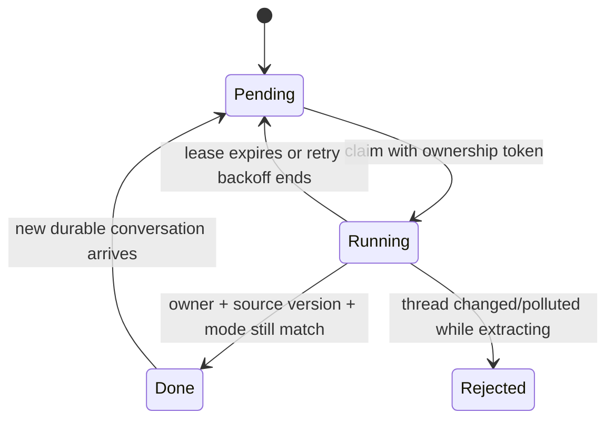

如果进程 A 的 lease 过期，进程 B 可以重新领取。A 后来醒来时，旧 ownership token 不能覆盖 B；如果
抽取期间 Thread 又新增了对话，旧 `source_updated_at` 也不能提交。两者分别防止 stale owner 和 stale
source。

### 3.7 长期记忆 Phase 2：全局合并与召回索引

Phase 1 的多个结果需要去重、纠错、合并。Phase 2 是 singleton consolidation job：

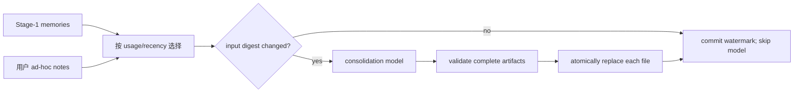

文件位于 `~/.corki/memories/`：

```text
memory_summary.md           每轮注入的小型路由索引
MEMORY.md                   可 grep 的详细长期知识
rollout_summaries/*.md      来源 Thread 的压缩说明
raw_memories.md             本次合并输入，便于审计
skills/*/SKILL.md           被提炼为可复用流程的经验
extensions/ad_hoc/notes/    用户显式记住/更新/忘记
```

生成失败不能覆盖上一版 artifacts。每个文件通过临时文件校验后原子替换；多个文件并非一个跨文件事务，
所以读取端面对缺失/短暂不一致时安全返回空 contribution。

### 3.8 具体例子：新 Thread 怎样想起“用户偏好 pytest”

假设旧 Thread 中用户多次明确说“这个项目统一用 pytest，不要 unittest”，Phase 1/2 已发布记忆。
新 Thread 的调用链是：

```text
MemoryContextContributor 读取 memory_summary.md（有 token 上限）
 -> ContextBuilder 将它放入 SESSION slot
 -> 模型看到“测试偏好：pytest；详情关键词 pytest workflow”
 -> 若 summary 足够，直接遵循
 -> 若需要证据，调用 memory search/read 或只读 shell grep MEMORY.md
 -> 相关片段作为 ToolResultItem 进入短期历史
 -> 模型在本任务中使用该偏好
```

[`MemoryContextContributor`](src/corki/memory/context.py) 只注入小索引（核心摘录）：

```python
summary = (self._root / "memory_summary.md").read_text(encoding="utf-8").strip()
summary = _truncate_tokens(summary, self._token_limit)
return (PromptContribution(
    key="memory.instructions",
    template_name="memory/read_path",
    role=PromptRole.DEVELOPER,
    slot=PromptSlot.SESSION,
    variables={"memory_root": str(self._root), "memory_summary": summary},
),)
```

这是一种 progressive disclosure：每轮固定成本只有 summary，详细记忆只在相关时检索，无关知识为
零 token。模型使用记忆后可输出内部 citation；Corki 将其转成结构化 provenance、从用户正文移除，
并增加被引用 Thread 的 usage count，后续合并更倾向保留真正有用的经验。

### 3.9 外部内容污染与遗忘

若开启 `memories_disable_on_external_context`，执行 `mcp__*` 工具前就把当前 Thread 标为 polluted。
外部内容可能无关或含 prompt injection；该 Thread 仍能继续对话，但不成为跨 Thread 记忆原料。

用户说“记住/更新/忘记”时，写入 `extensions/ad_hoc/notes/`，再由 Phase 2 与已有知识统一合并。不要
未经记录地修改数据库历史，也不要直接删掉 `MEMORY.md` 某行而丢失来源语义。

### 3.10 从零实现与测试

推荐顺序：

1. 先实现同 Thread append-only history 和 `active_history`；
2. 把 Turn 临时字段放进 LangGraph state/checkpoint；
3. 实现 token estimator 与 compaction marker；
4. 先手写 `memory_summary.md` 验证 read path；
5. 再实现 Phase 1 claim/extract/commit；
6. 最后实现 Phase 2 lease/digest/publish 和 citation usage。

必须测试：历史 round-trip、context tombstone、缺失 tool result 的确定性修复、当前输入不被摘要、同一
窗口不反复压缩、lease 接管后旧 owner 不可提交、Thread 更新后旧抽取被拒绝、非法合并不覆盖旧文件、
summary 超预算截断、polluted Thread 不被抽取。

> **本章检查点**：你应能沿“旧 Thread 原始 item → Phase 1 → Phase 2 → summary 注入 → 按需读取 →
> 新 Thread ToolResult”完整追踪一条记忆，并说明短期、工作、长期记忆分别由谁保存和召回。

### 3.11 可运行的最小跨 Thread 关键词 Memory

在实现两阶段自动提炼前，先用“显式写入 + 关键词检索”理解长期记忆闭环。下面代码完整实现 SQLite
存储、来源、简单中英文 term、Top-K 和输出预算。它依赖 10.9 的 canonical 类型；按文章顺序阅读时
先理解这里的算法，实际复制运行前先完成 10.9：

```python
# memory_store.py
from __future__ import annotations

import re
import sqlite3
from dataclasses import dataclass
from pathlib import Path
from uuid import uuid4


@dataclass(frozen=True, slots=True)
class MemoryHit:
    id: str
    text: str
    source_thread: str
    score: int


def terms(text: str) -> set[str]:
    lowered = text.casefold()
    words = set(re.findall(r"[a-z0-9_-]+", lowered))
    chinese_runs = re.findall(r"[\u4e00-\u9fff]+", lowered)
    bigrams = {
        run[index : index + 2]
        for run in chinese_runs
        for index in range(max(0, len(run) - 1))
    }
    return words | bigrams


class MemoryStore:
    def __init__(self, path: Path) -> None:
        self.connection = sqlite3.connect(path)
        self.connection.row_factory = sqlite3.Row
        self.connection.execute(
            """
            CREATE TABLE IF NOT EXISTS memories (
                id TEXT PRIMARY KEY,
                text TEXT NOT NULL,
                source_thread TEXT NOT NULL,
                updated_at TEXT NOT NULL DEFAULT CURRENT_TIMESTAMP
            )
            """
        )

    def remember(self, text: str, source_thread: str) -> str:
        normalized = text.strip()
        if not normalized or len(normalized) > 20_000:
            raise ValueError("memory text must contain 1 to 20000 characters")
        memory_id = str(uuid4())
        self.connection.execute(
            "INSERT INTO memories(id,text,source_thread) VALUES (?,?,?)",
            (memory_id, normalized, source_thread),
        )
        self.connection.commit()
        return memory_id

    def search(self, query: str, *, limit: int = 5, char_budget: int = 8_000):
        if not 1 <= limit <= 20:
            raise ValueError("limit must be between 1 and 20")
        if char_budget < 1:
            raise ValueError("char_budget must be positive")
        query_terms = terms(query)
        if not query_terms:
            return ()
        scored: list[MemoryHit] = []
        for row in self.connection.execute(
            "SELECT id,text,source_thread FROM memories ORDER BY updated_at DESC"
        ):
            score = len(query_terms & terms(row["text"]))
            if score:
                scored.append(MemoryHit(row["id"], row["text"], row["source_thread"], score))
        scored.sort(key=lambda hit: (-hit.score, hit.id))
        selected: list[MemoryHit] = []
        used = 0
        for hit in scored:
            metadata_cost = len(hit.source_thread) + 64
            remaining = char_budget - used - metadata_cost
            if remaining <= 0:
                continue
            if len(hit.text) > remaining:
                hit = MemoryHit(hit.id, hit.text[:remaining], hit.source_thread, hit.score)
            cost = len(hit.text) + metadata_cost
            selected.append(hit)
            used += cost
            if len(selected) == limit or used == char_budget:
                break
        return tuple(selected)

    def close(self) -> None:
        self.connection.close()
```

把它适配为第 4 章的两个普通 Tool：

```python
# memory_tools.py
import json
from dataclasses import asdict

from memory_store import MemoryStore
from mini_agent import ToolCall, ToolResult, ToolSpec


class RememberTool:
    def __init__(self, store: MemoryStore, source_thread: str):
        self.store, self.source_thread = store, source_thread

    @property
    def spec(self):
        return ToolSpec(
            "remember",
            "Store one explicit stable user preference or reusable fact.",
            {"type": "object", "properties": {"text": {"type": "string"}},
             "required": ["text"], "additionalProperties": False},
        )

    async def execute(self, call):
        memory_id = self.store.remember(call.arguments["text"], self.source_thread)
        return ToolResult(call.id, call.name, json.dumps({"memory_id": memory_id}))


class SearchMemoryTool:
    def __init__(self, store: MemoryStore):
        self.store = store

    @property
    def spec(self):
        return ToolSpec(
            "search_memory",
            "Search durable cross-thread memories; returns text and source_thread.",
            {"type": "object",
             "properties": {"query": {"type": "string"}, "limit": {"type": "integer"}},
             "required": ["query"], "additionalProperties": False},
        )

    async def execute(self, call):
        hits = self.store.search(
            call.arguments["query"], limit=int(call.arguments.get("limit", 5))
        )
        return ToolResult(
            call.id, call.name,
            json.dumps([asdict(hit) for hit in hits], ensure_ascii=False),
        )
```

测试两个 Thread：

```python
import asyncio

from memory_store import MemoryStore
from memory_tools import RememberTool, SearchMemoryTool
from mini_agent import ToolCall


def test_memory_crosses_threads(tmp_path):
    store = MemoryStore(tmp_path / "memory.db")
    old_thread = RememberTool(store, "thread-old")
    asyncio.run(old_thread.execute(
        ToolCall("remember-1", "remember", {"text": "这个项目统一使用 pytest"})
    ))

    search = SearchMemoryTool(store)  # 新 Thread 注册同一 durable store
    result = asyncio.run(search.execute(
        ToolCall("search-1", "search_memory", {"query": "项目 pytest 测试偏好"})
    ))

    assert "pytest" in result.content
    assert "thread-old" in result.content
    store.close()


def test_memory_result_never_exceeds_budget(tmp_path):
    store = MemoryStore(tmp_path / "memory.db")
    store.remember("pytest " * 100, "short-source")
    store.remember("pytest", "x" * 200)  # metadata 本身放不下，跳过该 hit

    hits = store.search("pytest", limit=5, char_budget=100)

    assert hits
    assert all(len(hit.text) + len(hit.source_thread) + 64 <= 100 for hit in hits)
    store.close()
```

这个 MVP 只保存用户显式要求记住的事实，不自动摄取所有对话，降低污染风险。理解后再加入 Phase 1 抽取、lease、
去重合并、summary routing 和 citation；Vector DB 也只需替换 `MemoryStore.search`，Tool/Observation
接线保持不变。

---

## 四、Tool Use（工具使用）

### 4.1 概念边界：定义、静态曝光、选择、执行、结果处理

一次工具调用至少包含五个阶段：

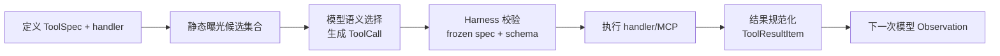

这里最容易混淆的是“召回”和“选择”：

- **静态曝光**：Harness 决定本 Step 把哪些 ToolSpec 放进模型请求；
- **语义选择**：模型根据用户意图、工具 name/description/schema 和上下文生成一个或多个 ToolCall；
- **程序路由**：Harness 看到 canonical ToolCallItem 后，确定性走 `execute_tools` 边；
- **执行校验**：Harness 再确认该工具确实位于本 Step frozen specs，参数合法，才调用 handler。

Corki 当前没有 embedding-based “从几万个工具中向量召回 Top-K”的工具检索器。它通过
`ToolExposure` 将所有 model-visible tools 静态曝光；Skills 用 metadata catalog 渐进读取，MCP/Plugin 工具在启动
阶段注册后也进入同一候选集合。工具很多时，未来可在 `model_visible_specs()` 前增加 `ToolRetriever`
端口，但不能跳过 frozen-plan 的名称校验。

### 4.2 源码地图

```text
src/corki/protocol/tools.py          ToolSpec/Call/Result/Exposure/Concurrency
src/corki/tools/base.py              Tool Protocol、ToolContext
src/corki/tools/registry.py          schema 与 handler 单一事实源
src/corki/tools/executor.py          参数校验、执行、错误与输出预算
src/corki/tools/builtin/             shell/process/patch/plan/image
src/corki/core/runtime.py            内置、skills、memory、MCP、plugin 注册
src/corki/core/graph.py              冻结 request_tools、执行/回灌
src/corki/mcp/tools.py               远程 MCP definition -> 本地 Tool adapter
```

### 4.3 工具定义：模型描述与可执行 handler 必须绑定

[`protocol/tools.py`](src/corki/protocol/tools.py) 定义四个核心值对象：

```python
@dataclass(frozen=True, slots=True)
class ToolSpec:
    name: str
    description: str
    parameters: Mapping[str, Any]
    exposure: ToolExposure = ToolExposure.DIRECT
    concurrency: ToolConcurrency = ToolConcurrency.EXCLUSIVE
    output_char_budget: int | None = None

@dataclass(frozen=True, slots=True)
class ToolCall:
    id: ToolCallId
    name: str
    arguments: Mapping[str, Any] | None
    raw_arguments: str = ""
    parse_error: str | None = None

@dataclass(frozen=True, slots=True)
class ToolResult:
    call_id: ToolCallId
    tool_name: str
    content: str
    is_error: bool = False
    display_content: str | None = None
    attachments: tuple[ImageAttachment, ...] = ()
    state_update: ToolStateUpdate = field(default_factory=ToolStateUpdate)
```

- `ToolSpec` 是模型能看见的契约；
- `ToolCall` 是模型返回、Provider adapter 解析出的事实；
- `ToolResult` 是执行器内部的规范结果；
- `ToolResultItem` 是写入 canonical history 的 Observation。

Tool Protocol 将 spec 与执行绑定在一个对象：

```python
class Tool(Protocol):
    @property
    def spec(self) -> ToolSpec: ...
    async def execute(self, call: ToolCall, context: ToolContext) -> ToolResult: ...
```

这样不能只注册 schema 而忘记 handler，也不能写了 handler 却忘记告诉模型怎样调用。

### 4.4 ToolRegistry：候选工具怎样形成

Runtime 先注册内置工具：

```python
registry.register(ExecCommandTool(...))
registry.register(WriteStdinTool(...))
registry.register(ApplyPatchTool())
registry.register(UpdatePlanTool())
registry.register(ViewImageTool())
```

然后根据配置增加 memory tools、skill tools、Plugin Python tools 和 MCP tools。所有来源最终都走同一
[`ToolRegistry`](src/corki/tools/registry.py)：

```python
def register(self, tool: Tool) -> None:
    if self._sealed:
        raise RuntimeError("tool registry is sealed for runtime execution")
    name = tool.spec.name
    if name in self._tools:
        raise DuplicateToolError(f"tool already registered: {name}")
    self._tools[name] = tool

def model_visible_specs(self) -> tuple[ToolSpec, ...]:
    return tuple(
        tool.spec for tool in self._tools.values()
        if tool.spec.exposure.is_model_visible
    )
```

`ToolExposure` 预留 direct、deferred、model-only、code-mode-only 和 hidden。当前
`is_model_visible` 只让 `DIRECT` 与 `DIRECT_MODEL_ONLY` 进入直接调用候选。

所有可失败的 MCP/plugin 初始化完成、graph 编译成功后，Runtime 调用 `registry.seal()`。运行期间禁止
替换 handler，避免模型看到“工具 A 的描述”，执行时却运行“新 A 的代码”。

### 4.5 每个模型 Step 为什么要冻结候选工具

`prepare_model_context` 在调用模型前生成快照：

```python
request_tools = self._registry.model_visible_specs()
prepared = await self._window_manager.prepare(
    thread_id=state["thread_id"],
    turn_id=state["turn_id"],
    snapshot=snapshot,
    tools=request_tools,
    pending_items=state.get("pending_input_items", ()),
)
return {
    "request_items": prepared.items,
    "request_tools": request_tools,
    "context_instructions": snapshot.instructions,
}
```

`call_model` 把同一个 `state["request_tools"]` 放进 `ModelRequest`。`execute_tools` 也读取这份 checkpointed
tuple，而不是重新向 registry 查询：

```python
advertised = {spec.name: spec for spec in state["request_tools"]}
if call.name not in advertised:
    result = executor.error(call, f"tool was not advertised: {call.name}")
else:
    result = cached or await executor.execute(call, ToolContext(cwd=Path(state["cwd"])))
```

这构成一次 Step 的**曝光契约快照**：它能阻止执行模型当时未获知的工具名，但当前实现仍从新进程的
Registry 获取同名 handler，并用当前 handler 的 schema 校验。因此升级后若同名工具实现/schema 改变，
旧 checkpoint 可能调用新实现；它不是完整的 capability version freeze。生产增强应给规范化 ToolSpec
和 handler version 计算 digest，恢复时与 snapshot 比较，不一致则拒绝自动执行。

### 4.6 模型究竟怎样“选择”工具

以用户问“今天北京天气怎么样”为例，分两种情况。

#### 情况 A：没有天气能力

Corki 默认内置工具是命令、进程输入、patch、plan 和图片查看，没有内置 `get_weather`。如果没有配置
天气 MCP/Plugin，模型请求中的 tools 数组就没有天气工具。模型不能合法生成不存在的能力；它应说明
无法获得实时天气，或者仅在现有工具确实能访问网络且规则允许时选择相应工具。

Harness 绝不能因为输入含“天气”就伪造结果，也不能硬编码：

```python
# 错误：graph 中的业务关键词路由会无限增长
if "天气" in user_input:
    return call_weather_api()
```

#### 情况 B：配置了天气 MCP server

远程 MCP definition 可能是：

```json
{
  "name": "get_weather",
  "description": "Get current observed weather for a city.",
  "inputSchema": {
    "type": "object",
    "properties": {"city": {"type": "string"}},
    "required": ["city"],
    "additionalProperties": false
  },
  "annotations": {"readOnlyHint": true}
}
```

`MCPTool` 将它适配成 `mcp__weather__get_weather`；readOnlyHint 映射为 `PARALLEL`。本 Step 的
ModelRequest 同时包含用户文本与这个 ToolSpec。LLM 根据 description/schema 生成：

```json
{
  "id": "call_01",
  "name": "mcp__weather__get_weather",
  "arguments": {"city": "北京"}
}
```

这里模型完成的是语义匹配：识别“今天/北京/天气”，对齐“current weather/city”，并填充 schema。
Harness 不读取模型隐藏推理，只解析结构化 call。流程为：

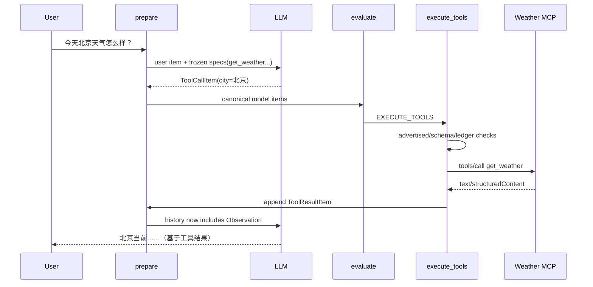

如果模型幻觉出 `weather_now`，frozen-spec 检查会返回 `is_error=True` 的 Observation，模型有机会改用
正确工具或坦诚失败，而不是 Python 抛 KeyError 终止整个 Turn。

### 4.7 ToolExecutor：模型参数与扩展结果都不可信

[`ToolExecutor`](src/corki/tools/executor.py) 是所有内置、MCP、Plugin 工具共同的执行边界（核心摘录）：

```python
async def execute(self, call: ToolCall, context: ToolContext) -> ToolResult:
    tool = self._registry.get(call.name)
    if tool is None:
        return self.error(call, f"unknown tool: {call.name}")
    if call.parse_error is not None or call.arguments is None:
        return self.error(call, f"invalid JSON arguments: {call.parse_error}")
    try:
        _validate(call.arguments, tool.spec.parameters, path="arguments")
        result = await tool.execute(call, context)
    except Exception as exc:
        return self.error(call, f"{type(exc).__name__}: {exc}")
    if not isinstance(result, ToolResult):
        return self.error(call, "tool returned wrong result type")
    if result.call_id != call.id or result.tool_name != call.name:
        return self.error(call, "tool returned a result for a different call")
    output_budget = tool.spec.output_char_budget or self._output_char_budget
    return ToolResult(
        call_id=result.call_id,
        tool_name=result.tool_name,
        content=truncate_text(result.content, output_budget),
        is_error=result.is_error,
        display_content=truncate_text(
            result.display_content if result.display_content is not None else result.content,
            min(output_budget, 4_000),
        ),
        attachments=result.attachments,
        state_update=result.state_update,
    )
```

即使 provider 声称 strict schema，Harness 仍二次验证。Corki validator 支持内置工具需要的 JSON Schema
子集：object/array/string/integer/number/boolean、required、enum、additionalProperties、items、数组
长度和数值上下界。若开放任意第三方 schema，应改用完整 validator，不能把未知关键字当成已校验。

`content` 给下一次模型，`display_content` 给 UI，两者预算不同。超长输出使用 head+tail 截断，既保留
错误开头，也保留尾部 stack trace。图片转换为受大小限制的 `ImageAttachment`，结构化 MCP content
序列化为 JSON 文本，最终统一成模型能理解的 Observation。

### 4.8 并行、独占与稳定结果顺序

`ToolSpec.concurrency` 声明：

- `PARALLEL`：只读搜索、天气查询、文件读取等可并行；
- `EXCLUSIVE`：patch、计划更新、有副作用命令等顺序执行。

Graph 将相邻 parallel calls 分批 `asyncio.gather`，遇到 exclusive 立即结束批次并单独执行。`gather`
按输入顺序返回，所以即使天气接口比代码搜索晚完成，history 仍按模型 call 顺序持久化，保证可重复。

```text
[parallel A, parallel B] -> gather -> append A,B
[exclusive C]            -> await  -> append C
[parallel D]             -> gather -> append D
```

### 4.9 副作用账本：防止恢复时重复执行

危险窗口是：

```text
工具已产生副作用 -> 进程崩溃 -> LangGraph 尚未 checkpoint
```

`_execute_one` 先按稳定 call id claim：

```python
cached = await repository.claim_tool_call(thread_id, turn_id, call)
result = cached or await executor.execute(call, ToolContext(cwd=cwd))
if cached is None:
    await repository.complete_tool_call(thread_id, turn_id, result)
```

完成结果可以复用；启动时遗留 running 被标记 interrupted。对于“可能已发送邮件/创建资源但结果未知”
的外部副作用，不能自动重跑。Checkpoint 只知道节点位置，tool ledger 才知道业务动作是否发生。

### 4.10 怎样实现自己的天气工具

下面用教学用 provider port，避免把 HTTP 细节塞进 Tool：

```python
class WeatherBackend(Protocol):
    async def current(self, city: str) -> Mapping[str, object]: ...

class CurrentWeatherTool:
    def __init__(self, backend: WeatherBackend) -> None:
        self._backend = backend

    @property
    def spec(self) -> ToolSpec:
        return ToolSpec(
            name="get_current_weather",
            description=(
                "Get current observed weather for one city. "
                "Use for current conditions, not historical climate."
            ),
            parameters={
                "type": "object",
                "properties": {"city": {"type": "string"}},
                "required": ["city"],
                "additionalProperties": False,
            },
            concurrency=ToolConcurrency.PARALLEL,
            output_char_budget=8_000,
        )

    async def execute(self, call: ToolCall, context: ToolContext) -> ToolResult:
        del context
        assert call.arguments is not None  # Executor 已验证
        city = str(call.arguments["city"]).strip()
        if not city:
            return ToolResult(call.id, call.name, "city must not be empty", is_error=True)
        value = await self._backend.current(city)
        content = json.dumps(
            {"city": city, "observed": value},
            ensure_ascii=False,
            separators=(",", ":"),
        )
        return ToolResult(call.id, call.name, content)
```

在 composition 阶段 `registry.register(CurrentWeatherTool(backend))` 即可。不要修改 Graph，也不要在
ContextBuilder 写 weather 特例。工具描述要区分 current/historical/forecast，schema 要消除参数歧义；
模型选择质量很大程度取决于这些文字和候选集合质量。

### 4.11 工具召回的可演进设计

当只有几十个工具，全量 direct specs 简单可靠。若未来有上万个企业工具，可以增加：

```python
class ToolRetriever(Protocol):
    async def retrieve(
        self, user_input: str, context: ContextSnapshot, limit: int
    ) -> tuple[ToolSpec, ...]: ...
```

候选可由关键词、BM25、embedding、权限和使用历史共同产生，但必须遵守：

```text
Registry 是 handler 全集
Retriever 只返回 Registry 中 specs
prepare 将候选冻结进 state.request_tools
call_model 与 execute_tools 使用同一 tuple
未入选工具不可执行
```

动态召回优化的是 token 与选择准确率，不应改变工具执行边界。当前 Corki 没有实现这段 Retriever；
它是明确的演进设计。评估 Retriever 应至少测 recall@k、无关候选率、权限过滤和零结果降级。

### 4.12 从零实现与测试

实现顺序：ToolSpec/Call/Result → Tool Protocol → Registry → schema validator → Executor → 一个纯函数
工具 → Graph tool loop → ledger → parallel/exclusive → MCP/Plugin adapters。

测试无需真实 LLM。下面是使用测试 DSL 的结构示意，`completed/tool_call/assistant/make_runtime/collect`
是你在 test helpers 中实现的构造器，不是可直接复制的生产 API；可直接运行的等价测试见 10.9：

```python
async def test_weather_tool_exposure_execution_and_recall(tmp_path):
    model = ScriptedModel([
        completed(tool_call("c1", "get_current_weather", {"city": "北京"})),
        completed(assistant("北京当前 22°C")),
    ])
    backend = FakeWeatherBackend({"temperature_c": 22, "condition": "晴"})
    runtime = make_runtime(model, [CurrentWeatherTool(backend)], tmp_path)

    events = await collect(runtime.stream("今天北京天气怎么样？"))

    assert backend.calls == ["北京"]
    assert model.requests[0].tools[0].name == "get_current_weather"
    assert isinstance(model.requests[1].items[-1], ToolResultItem)
    assert '"temperature_c":22' in model.requests[1].items[-1].content
    assert events[-1].answer == "北京当前 22°C"
```

再测试：候选中无天气工具、模型幻觉名称、缺少 city、额外字段、backend 抛错、超长结果、两个 parallel
调用顺序、exclusive 屏障、完成后崩溃再恢复只执行一次。

这个离线 ScriptedModel 已预写 ToolCall，因此只能证明“曝光、执行、Observation 回灌”的 Harness 契约，
不能证明真实模型会选择正确工具。选择质量要用单独的可选 online eval：提供天气/历史气候/城市搜索等
相似 distractor tools，覆盖应调用、无需调用、信息不足需澄清、目标工具不可用等样例，统计正确工具、
参数和不调用率。录制 provider 响应可做协议回归，但不能替代随模型版本运行的选择质量评估。

> **本章检查点**：你应能从 `registry.register()` 一直追踪到第二次模型请求中的 ToolResultItem；还能
> 精确指出天气例子中候选工具由谁筛选、最终工具由谁选择、执行前由谁再次验证。

---

## 五、Context Engineering（上下文工程）

### 5.1 概念边界：Context 是本次采样的输入产品

Memory 关注信息怎样长期存在；Context Engineering 关注**下一次模型采样应该看到哪些信息、以什么
角色和顺序看到、总量是否在窗口内**。

一次 Corki 请求可能包含：

```text
base agent instructions
+ mode/realtime instructions
+ memory routing summary
+ project AGENTS.md
+ cwd/date/shell/Git snapshot
+ skill/MCP/plugin catalogs
+ active conversation history
+ current user input
+ frozen tool schemas
+ optional images/opaque reasoning
```

Prompt 模板化、窗口管理、摘要压缩、检索增强都属于 Context Engineering；SQLite 是否保存这些事实
属于 Memory/State；工具怎样执行属于 Tool Use。

### 5.2 源码地图

```text
prompts/                              可审查的 Markdown 模板
src/corki/prompting/store.py          模板加载、变量检查、缓存
src/corki/prompting/assembly.py       contribution key/role/slot/order
src/corki/context/builder.py          项目与扩展快照
src/corki/context/project.py          Git/project inspect
src/corki/context/instructions.py     层级 AGENTS.md
src/corki/context/history.py          active conversation view
src/corki/context/tokens.py           请求整体 token 估算
src/corki/context/window.py           增量 context 与自动压缩
src/corki/context/extensions.py       ContextContributor port
```

### 5.3 Prompt 模板化：存模板，不存巨大 Python 字符串

Corki 把模板放在根目录 `prompts/`，变量语法是 `#{variable}`。`PromptStore` 做三件关键工作：

1. 将 template name 规范化并限制在 prompt root 内，拒绝 `../`；
2. 加载后缓存模板原文和变量集合；
3. 每次 render 要求传入变量与模板变量完全匹配。

为什么不缓存渲染结果？`cwd/date/git_status/user_input` 每 Step 可能变化；缓存原文节省 I/O，重新渲染
确保快照新鲜。严格 exact variables 能在启动/测试时发现模板重命名导致的遗漏，而不是把
`#{unknown}` 原样发送给模型。

模板大致分层：

```text
agent/base.md                 稳定身份与通用行为
modes/default.md              当前交互模式
context/environment.md        cwd/shell/date/timezone
context/project.md            project root/git branch/status
context/agents.md             层级项目指令
memory/read_path.md           长期记忆检索协议
extensions/*/catalog.md       skills/MCP/plugin 能力说明
tasks/compact.md              独立摘要任务
```

不要把压缩任务 prompt 与主 Agent prompt 混在一起；两者输出契约和可用工具不同。

#### 一个可直接使用的最小 base prompt

学生实现可先使用下面这份完整策略，再逐步拆为 Corki 的多模板结构：

```markdown
You are a coding agent working in the user's current project.

For each turn:
1. Read the supplied project rules and current environment before acting.
2. Use only tools present in this request. Never invent tool names or results.
3. For a multi-step task, create a short plan and keep at most one step in progress.
4. Before editing, inspect the relevant code and tests. Preserve unrelated changes.
5. Treat every tool result as an observation: check whether it supports the current
   hypothesis, and revise the plan when it does not.
6. After an edit, run the narrowest meaningful verification when possible.
7. If a tool fails, reason from its error; do not claim the action succeeded.
8. Stop calling tools when the request is resolved or no safe useful action remains.
9. In the final answer, state the outcome, important changes, verification, and blockers.
```

最小 environment/project 模板：

```markdown
<environment>
cwd: #{cwd}
shell: #{shell}
date: #{current_date}
timezone: #{timezone}
</environment>

<project>
root: #{project_root}
git_branch: #{git_branch}
git_status:
#{git_status}
</project>

<project_instructions directory="#{directory}">
#{instructions}
</project_instructions>
```

最小 compaction prompt：

```markdown
Summarize the supplied conversation for another coding agent that must continue the
unfinished task. Preserve the user's exact goal, confirmed facts, changed files, tool
results, current plan, unresolved errors, and next action. Omit filler, repeated guesses,
and obsolete hypotheses. Do not invent actions or claim unverified success.
```

Prompt 只能影响模型行为，不能替代 Harness 校验：第 2 条仍需 frozen-name 检查，第 3 条仍需
`validate_plan`，第 6/7 条仍需真实 ToolResult，第 8 条仍需 Step/Call 上限。

### 5.4 PromptContribution：让功能声明上下文，而不是修改 Builder

[`PromptContribution`](src/corki/prompting/assembly.py) 包含：

```text
key              稳定身份，用于冲突检测与增量 world-state
template_name    使用哪个模板
role             developer 或 user
slot/order       全局确定顺序
variables        本次渲染参数
separate_message 预留的独立消息意图（当前 Builder 尚未消费）
```

slot 的枚举顺序为：

```text
SESSION -> REALTIME -> PROJECT_INSTRUCTIONS -> PERMISSIONS
        -> COLLABORATION_MODE -> ENVIRONMENT -> EXTENSIONS
        -> MULTI_AGENT -> TURN
```

扩展只实现 ContextContributor：

```python
class ContextContributor(Protocol):
    def contributions(
        self, *, cwd: Path, user_input: str, realtime_active: bool
    ) -> tuple[PromptContribution, ...]: ...
```

Memory、Skills、Plugin、Realtime 都返回 contribution，`ContextBuilder` 无需出现
`if memory_enabled`、`if plugin_x`。Assembler 在一个地方排序并拒绝重复 key，防止加载顺序偶然改变
system prompt。

真实排序键是 `(role_order, slot, order, insertion_index)`：所有 developer-role contribution 先于
user-role contribution，同一 role 内才按 slot/order 排序。因此 slot 不是跨 role 的唯一全局顺序。
`separate_message` 当前会保留在 RenderedPrompt 中，但 Builder/provider 尚未根据它改变分组；它是扩展
位，不应当作已生效行为。

### 5.5 ContextBuilder 怎样生成当前 world snapshot

[`ContextBuilder.build`](src/corki/context/builder.py) 的主流程：

```python
project = await inspect_project(cwd)
agents = load_project_instructions(project.root, cwd)
contributions = [
    mode_contribution(),
    environment_contribution(cwd, shell, date, timezone),
    project_contribution(project.root, project.git_branch, project.git_status),
]
if agents:
    contributions.append(project_agents_contribution(agents))
for contributor in self._contributors:
    contributions.extend(contributor.contributions(
        cwd=cwd, user_input=user_input, realtime_active=realtime_active
    ))
assembly = self._assembler.assemble(
    base_template="agent/base", contributions=contributions
)
return ContextSnapshot(
    instructions=assembly.instructions,
    items=tuple(ContextItem(fragment.key, ...) for fragment in assembly.fragments),
    project_root=project.root,
)
```

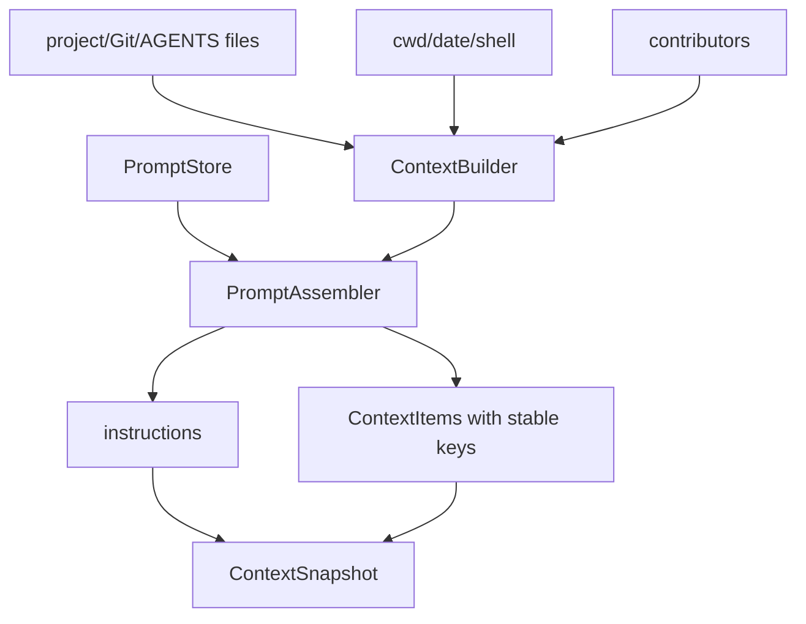

项目指令从 project root 到 cwd 分层加载，越靠近 cwd 越具体，但不越过 root。Harness 主动加载规则，
而不是让模型每 Step 自己搜索，否则规则可能晚于第一次危险动作才被发现。

### 5.6 增量上下文：只追加变化的 world state

Git 状态、时间和扩展 catalog 会变化，但每轮 append 全量 snapshot 会快速膨胀。WindowManager 按稳定
key 比较最新历史：

```python
latest = {}
for item in history:
    if isinstance(item, ContextItem):
        latest[item.key] = item

changed = [
    replace(item, turn_id=turn_id)
    for item in snapshot
    if latest.get(item.key) is None or latest[item.key].content != item.content
]
removed = [
    ContextItem(key, old.role, "", turn_id)
    for key, old in latest.items()
    if key not in current_keys and old.content
]
```

空内容是 tombstone。物理 history 保留旧 Git snapshot，`active_history` 只暴露同 key 最后一条非空值。
如果每次生成随机 key，就失去增量效果；如果两个 feature 共用 key，就会错误覆盖，因此 key 是持久化
协议的一部分。

### 5.7 模型请求的三条通道与顺序

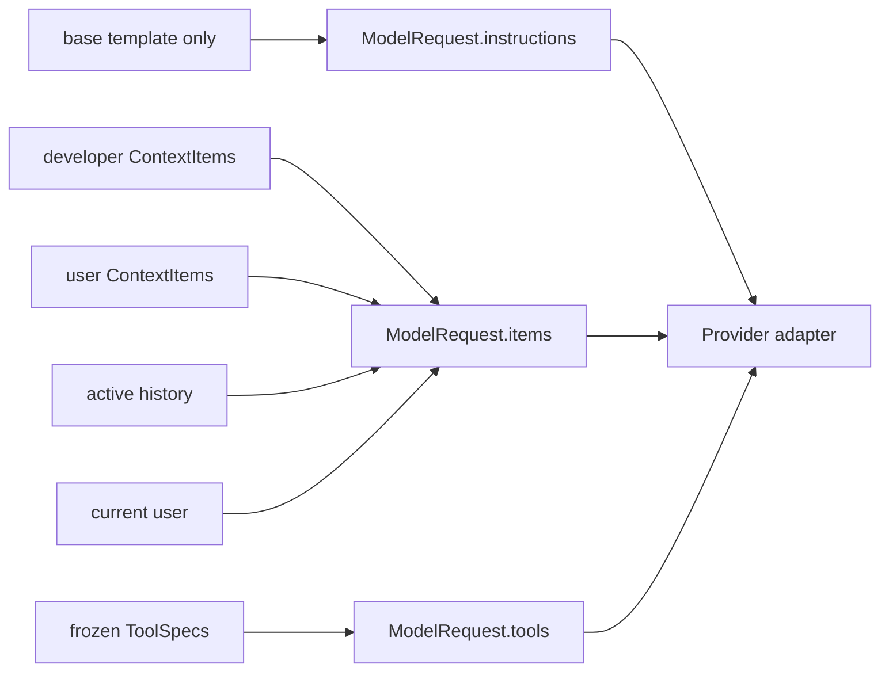

在 Turn 开始时，changed context 和 pending user 在一次 append 中按 `context -> user` 排列；这样规则
位于它所限定的输入之前。工具返回后图再次进入 prepare，Git/project snapshot 可刷新，下一次模型
不会继续使用修改前的 world state。

Provider adapter 最后才映射 role：Chat Completions 生成 messages，Responses 生成 instructions/input。
核心层不应该提前存某个 wire format。

### 5.8 Token 预算：必须估算完整请求

[`context/tokens.py`](src/corki/context/tokens.py) 统一估算：

- instructions、context 和普通对话文本；
- ToolSpec description 与 JSON Schema；
- tool call 原始 arguments 与 tool result；
- reasoning/encrypted reasoning；
- image attachment 及 detail；
- 每类 item 内部的保守 framing overhead。

只计算 `len(messages)` 会漏掉工具 schema 和图片。以 128k 窗口为例：

```text
instructions      8k
tool schemas     14k
active history   66k
images            7k
current input     4k
framing reserve   2k
--------------------
estimated       101k
```

表中的 2k 是部署者做容量规划时额外预留的示意值，不是 Corki 当前某个独立常量。若 auto-compact
是 96k，就先压缩；hard window 可设 120k，剩余空间留给估算误差和模型输出。自动阈值必须低于硬
上限，因为生成摘要本身也需要上下文。

第 3 章已经解释压缩的存储语义；从 Context 角度，算法的输出契约只有两个：返回一个结构完整、低于
hard limit 的 `PreparedHistory`，并逐字保留当前用户意图。

### 5.9 RAG：外部知识怎样进入当前请求

RAG 的核心不是必须使用向量数据库，而是：

```text
query/意图 -> 检索候选 -> 过滤/预算 -> 注入上下文 -> 生成带证据的答案
```

Corki 当前有两种实际路径：

1. 长期 Memory：每轮注入 routing summary，模型再搜索/读取 `MEMORY.md` 或 rollout；
2. MCP：远程资源、模板、搜索/数据库工具注册为 Tool，结果以 ToolResultItem 注入下一 Step。

若实现企业文档 Vector RAG，推荐把检索封装为 Tool：

```python
search_knowledge_base(query, top_k, filters) -> [
    {"text": "...", "source": "...", "score": 0.83}
]
```

模型根据问题生成 query，Harness 校验 top_k/filters，Retriever 返回带来源片段，Executor 截断并转成
Observation。不要把整个知识库在每轮无条件放进 system prompt。

#### 例子：“公司退款规则是什么？”

```text
prepare: 注入 knowledge-search ToolSpec，不注入所有文档
model: 调用 search_knowledge_base(query="退款 条件 时限", top_k=4)
executor: 校验 top_k，调用向量/BM25 backend
result: 4 个带 source/id 的片段
prepare: 将 ToolResultItem 纳入 active history
model: 基于片段回答，并保留来源标识
```

如果检索为空，模型应说明证据不足；Harness 不能让模型把一般知识伪装成企业规则。

### 5.10 从零实现与测试

实现顺序：PromptStore → Contribution/Assembler → ContextBuilder → stable-key delta → full-request token
estimator → WindowManager/compaction → 一个检索 Tool → source/citation 处理。

必须测试：模板路径逃逸、变量缺失/多余、重复 contribution key、slot 顺序、层级 AGENTS 边界、context
未变化不追加、删除产生 tombstone、context 在 user 前、工具修改后 snapshot 刷新、schema/image 计入
预算、当前输入不被压缩、检索空结果/超长片段/来源字段保留。

> **本章检查点**：给定 base prompt、2 条 project rules、5 条 history、3 个工具和 1 张图片，你应能
> 写出它们进入 ModelRequest 的位置与估算顺序，并说明 RAG 的检索结果为何应作为 canonical Observation。

---

## 六、State Management（状态管理）

### 6.1 概念边界：状态不只是一个 messages 数组

State Management 负责三件事：

1. **执行状态追踪**：当前 Turn、Step、路由、成功/失败/取消；
2. **变量存储**：pending input、冻结请求、最后模型输出、plan、计数器；
3. **流程控制**：条件边、循环、并行工具、checkpoint、resume 与 cancel。

Memory 的工作记忆回答“保存哪些中间事实”；State Management 回答“这些事实怎样驱动程序以及在故障
后从哪里继续”。

### 6.2 源码地图

```text
src/corki/core/state.py              CorkiState
src/corki/core/graph.py              GraphRunContext、六节点与条件边
src/corki/core/runtime.py            Turn 生命周期、事件泵、resume/cancel
src/corki/protocol/events.py         UI/observer 输出协议
src/corki/sessions/models.py         Thread/Turn 状态
src/corki/sessions/repository.py     业务持久化 port
src/corki/storage/sqlite.py          items/model steps/tool ledger
LangGraph AsyncSqliteSaver           节点 checkpoint
```

### 6.3 Thread、Turn、Model Step 三个时间尺度

```text
Thread：一段可 resume 的连续对话
└── Turn：一条用户目标从 started 到 completed/failed/cancelled
    ├── Model Step 0：第一次模型采样
    ├── Tool calls/results
    ├── Model Step 1：读到 Observation 后再次采样
    └── ...
```

`ThreadId` 选择历史，`TurnId` 标识一次任务并隔离 checkpoint，`ModelStepId` 关联一次响应中的 reasoning、
assistant text 和 tool calls。即使底层都是字符串，也应使用不同 NewType/类型，避免传错。

### 6.4 CorkiState：只保存可恢复事实

真实 state 的字段按职责分组：

```python
class CorkiState(TypedDict):
    # identity
    thread_id: ThreadId
    turn_id: TurnId
    cwd: str

    # current request snapshot
    user_input: str
    request_items: tuple[ConversationItem, ...]
    request_tools: tuple[ToolSpec, ...]
    context_instructions: str
    pending_input_items: tuple[UserMessageItem, ...]

    # latest work/result
    last_model_items: tuple[ConversationItem, ...]
    plan: tuple[dict[str, str], ...]

    # control state
    step_count: int
    tool_call_count: int
    route: str
    status: str
    final_answer: str | None
    error: str | None
    realtime_active: bool
    model_interrupted: bool
```

判断字段是否进入 state 的三问：

1. 进程在下一个节点前崩溃，恢复时是否必须知道？
2. 它能否稳定序列化，跨进程后仍有相同语义？
3. 它是业务事实，还是产生事实的临时能力？

`request_tools` 三问都通过；`ToolRegistry`、`httpx.AsyncClient`、SQLite connection、async Queue、Lock、
Task、PTY handle 不通过，不能进入 checkpoint。

短生命周期能力通过 `GraphRunContext` 提供：

```python
@dataclass(frozen=True, slots=True)
class GraphRunContext:
    events: EventSink
    realtime: RealtimeController
```

### 6.5 用 StateGraph 表达条件分支和循环

[`CorkiGraph.compile`](src/corki/core/graph.py) 的核心结构：

```python
builder = StateGraph(CorkiState, context_schema=GraphRunContext)
builder.add_node("prepare_model_context", self._prepare_model_context)
builder.add_node("call_model", self._call_model)
builder.add_node("evaluate", self._evaluate)
builder.add_node("execute_tools", self._execute_tools)
builder.add_node("finalize", self._finalize)
builder.add_node("fail", self._fail)

builder.add_edge(START, "prepare_model_context")
builder.add_edge("prepare_model_context", "call_model")
builder.add_conditional_edges(
    "call_model", _route_after_model,
    {"steered": "prepare_model_context", "sampled": "evaluate"},
)
builder.add_conditional_edges(
    "evaluate", _route_after_evaluation,
    {"execute_tools": "execute_tools", "finalize": "finalize", "fail": "fail"},
)
builder.add_edge("execute_tools", "prepare_model_context")
builder.add_edge("finalize", END)
builder.add_edge("fail", END)
return builder.compile(name="corki-agent", checkpointer=checkpointer)
```

路由函数只读 state，不做 I/O：

```python
def _route_after_model(state):
    return "steered" if state.get("model_interrupted", False) else "sampled"

def _route_after_evaluation(state):
    return state["route"]
```

纯路由保证相同 checkpoint 得到相同边。数据库、模型和工具副作用只发生在节点或 Runtime，并由事务/
幂等键保护。

### 6.6 六个节点的状态契约

| 节点 | 主要输入 | state patch | 外部副作用 | 重跑保护 |
| --- | --- | --- | --- | --- |
| prepare | cwd、pending、history | request snapshot | append context/user | item ID 幂等 |
| call_model | snapshot、step index | last items、step+1 | 模型流、commit step | `(thread,turn,index)` |
| evaluate | last items、计数器 | route/error | 无 | 纯函数 |
| execute_tools | calls、frozen tools | plan、call count | handler、append result | call-id ledger |
| finalize | assistant items | completed/answer | 无 | 纯转换 |
| fail | evaluation error | failed | 无 | 纯转换 |

节点返回它负责的增量字典，不返回整份旧 state。节点内不要 print UI，不要让路由函数查数据库。

### 6.7 一次 Turn 的 state 怎样变化

用户请求“读取 pyproject.toml 并告诉我项目名”：

```text
Runtime initial
  pending=(UserItem,), request_items=(), step=0, calls=0, status=created

prepare #1
  request_items=(context..., user), request_tools=(...), pending=(), status=running

call_model #1
  last_model_items=(ToolCallItem(read file),), step=1

evaluate #1
  route=execute_tools

execute_tools
  append ToolResultItem(file contents), calls=1

prepare #2
  reload active history and refreshed Git state

call_model #2
  last_model_items=(AssistantMessageItem("项目名是 corki"),), step=2

evaluate #2
  route=finalize

finalize
  status=completed, final_answer="项目名是 corki"

Runtime
  save Turn COMPLETED, emit TurnCompleted
```

Graph state 决定流程，canonical history 是模型记忆，RuntimeEvent 报告过程。三者不是同一个 list。

### 6.8 并行工具属于受控子流程

一个 Model Step 可产生多个 ToolCallItem。Graph 按 ToolSpec concurrency 形成批次：相邻 parallel 使用
`asyncio.gather`，exclusive 单独 await。并行 Task 是当前 graph node 的子任务，节点取消时必须全部
取消并等待；结果按原调用顺序提交，然后一次性更新计数和 plan。

LangGraph 节点级并行适合互相独立的业务分支；Corki 当前工具并行在单个 tool node 内完成，因为所有
结果都要汇回同一个 canonical history。以后加入真正多 Agent 时应新增显式子图/状态，而不是让后台
Task 脱离所有权。

### 6.9 Runtime 是状态机的生命周期外壳

`LangGraphRuntime` 不是第七个节点。它负责：

- composition：model/repository/tools/context/memory/MCP/plugin；
- 创建 Thread/Turn 和初始 state；
- 编译带 SQLite checkpointer 的 graph；
- 驱动 `ainvoke` 并把内部事件变成 async iterator；
- 提交最终 Turn status；
- resume、realtime steering、cancel、close。

关系是：

```text
Runtime = 谁启动、拥有和结束一次图运行
Graph   = 状态怎样经过节点和边变化
Event   = 外部观察者怎样看到过程
```

### 6.10 RuntimeEvent 与有界事件泵

Graph node 只依赖：

```python
class EventSink(Protocol):
    async def emit(self, event: RuntimeEvent) -> None: ...
```

Runtime 用有界 Queue 提供 backpressure，并用独立 Event 表示 producer 完成：

```python
queue = asyncio.Queue(maxsize=event_queue_size)
producer_done = asyncio.Event()

async def run_graph():
    try:
        result = await compiled.ainvoke(initial, context=run_context, config=config)
    finally:
        producer_done.set()  # 不与数据争夺 queue slot

task = asyncio.create_task(run_graph())
while not producer_done.is_set() or not queue.empty():
    event_waiter = asyncio.create_task(queue.get())
    done_waiter = asyncio.create_task(producer_done.wait())
    finished, _ = await asyncio.wait(
        (event_waiter, done_waiter), return_when=asyncio.FIRST_COMPLETED
    )
    cancel_and_await_unfinished_waiters()
    if event_waiter in finished:
        yield event_waiter.result()
await task
```

若把 completion sentinel 也 `put()` 到已满 Queue，取消时 producer/consumer 可能互等。每轮未完成
waiter 也必须 cancel + gather，否则泄漏 Task。

### 6.11 两个 SQLite 与恢复收敛

```text
sessions/corki.db        Thread/Turn/items/model_steps/tool_executions/memory jobs
sessions/checkpoints.db  LangGraph CorkiState 与节点位置
```

两库不是一个跨库事务。Checkpoint 告诉 Runtime 从哪个节点重进；业务表用稳定 ID 告诉节点哪些动作
已完成。典型恢复窗口：

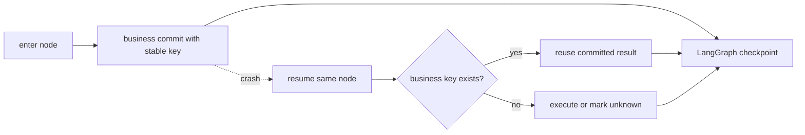

- model step key：`(thread_id, turn_id, step_index)`；
- tool effect key：当前是全局主键 `call_id`，claim 时校验 thread/turn/name；
- conversation item key：稳定 `item_id`，相同 payload 可重放，不同 payload 是 integrity error。

这提供可解释的 at-most-once/幂等恢复边界，不应笼统宣称任意外部副作用 exactly-once。

当前 `tool_executions` 没有保存 arguments，因此同 thread/turn/name 下复用同一 call id 但换参数时，账本
本身无法检测。Provider 通常给 call id，但教材实现应更强：存规范化 arguments JSON/hash，并在 claim
时比较；或者使用 `(thread_id, turn_id, call_id)` 复合主键再保存参数摘要。未做增强前，不能宣称账本
已经验证 arguments，也要求 provider/harness 的 call id 在业务库范围内不碰撞。

### 6.12 Resume、取消与 realtime steering

`resume_pending()` 找最新 RUNNING Turn，查询 `thread_id:turn_id` checkpoint：有 checkpoint 时向
`ainvoke` 传 `initial=None` 从保存节点继续；没有时从业务 UserItem 重建初始 state。已提交 model step
和 ToolResult 由各自账本复用。

取消顺序：先取消 graph task，等待 `CancelledError` 传播；终止所有 managed subprocess；保存 Turn
CANCELLED；发唯一 `TurnCancelled`；清理 realtime。`CancelledError` 是控制流，不能被宽泛异常边界吞掉。

Realtime steering 不是 WebSocket 音视频协议，而是同一 Turn 中追加文本要求。`call_model` 同时等待模型
下一 delta 和 realtime command；若新命令先到，关闭当前 iterator、持久化新 UserItem、设置
`model_interrupted=True`，条件边回 prepare 重建完整请求，不把文字硬拼进正在发送的 HTTP body。

### 6.13 从零实现与测试

实现顺序：ID/Turn status → TypedDict state → 两节点 chat graph → evaluate/tool loop → Runtime 生命周期 →
typed events + bounded queue → business SQLite → LangGraph saver → model/tool ledgers → resume/cancel/realtime。

故障注入矩阵必须覆盖：user append 后、model commit 后、tool claim 后、tool complete 后、terminal
checkpoint 后、Turn save 前。每次用全新 Runtime 实例恢复，断言输入不重复、模型/工具不重复、未知
副作用不静默重跑、最终只有一个逻辑终态、无遗留 Task/进程。

> **本章检查点**：你应能从初始 state 手算一次两 Step 工具 Turn 的每个 patch；还能解释为什么
> `request_tools` 属于 state，而 Registry/Queue 不属于，以及 checkpoint 与业务 ledger 各解决什么问题。

---

## 七、五大组件怎样协作完成一个任务

用户输入：“修复 SSE 解析器在收到 `response.completed` 后仍等待连接关闭的问题，并运行相关测试。”

### 7.1 完整时序

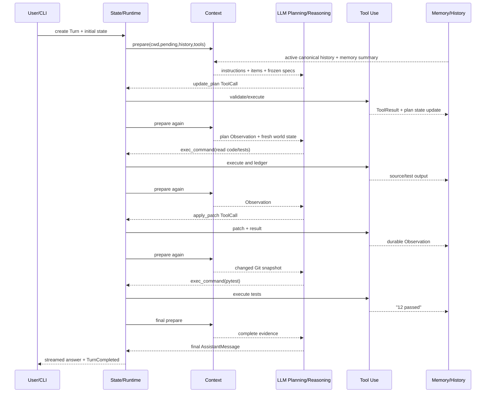

### 7.2 每一步五个组件分别做什么

| 时刻 | Planning & Reasoning | Memory | Tool Use | Context | State |
| --- | --- | --- | --- | --- | --- |
| Turn 开始 | 判断任务复杂，准备建 plan | 加载同 Thread/长期 summary | 候选工具尚未调用 | 组装项目规则、Git、历史、schemas | pending user，step=0 |
| 建计划 | 生成 update_plan call | call/result 写 history | schema 校验并产生 state update | 下 Step 召回 plan Observation | `state.plan` 更新 |
| 读源码 | 决定先收集证据 | 保存命令输出 | 执行命令、截断结果 | 新窗口含源码 Observation | calls/step 递增 |
| 修复 | 根据证据修正原假设 | 保存 patch result | 独占执行 patch | Git snapshot 变为 modified | ledger 防重复 patch |
| 验证 | 判断需要测试 | 保存测试输出 | 执行 pytest | 下一 Step 含 `12 passed` | 若崩溃可 resume |
| 完成 | 有证据后给结论 | 保存 AssistantItem | 无工具调用 | 请求仍在 token 限制内 | evaluate→finalize→Turn complete |

### 7.3 四种数据不要混在一起

```text
CorkiState
  = 当前图需要恢复的控制事实

ConversationItem history
  = 模型跨 Step 观察到的语义事实

Tool execution ledger
  = 某个外部副作用是否执行过的业务事实

RuntimeEvent stream
  = UI/日志观察过程的通知
```

例如 `ToolCallCompleted` 事件已经显示，不等于 ToolResult 已持久化；`state.final_answer` 已生成，也不等于
Turn 表已提交；checkpoint 位于 execute_tools，也不等于 shell 没运行。成熟 Harness 用不同协议表达
不同真相，再通过稳定 ID 将它们关联。

### 7.4 如果其中一个组件缺失会怎样

| 缺失组件 | 结果 |
| --- | --- |
| Planning & Reasoning | 只能机械调用固定流程，复杂任务无法基于 Observation 调整 |
| Memory | 工具结果下一 Step 消失，多轮/跨 Thread 不连续 |
| Tool Use | 模型只能描述“应该修改”，无法验证真实代码和测试 |
| Context Engineering | 规则、代码、历史和工具无序堆叠，超窗或遗漏关键信息 |
| State Management | 无可靠循环、取消和恢复，副作用可能重复 |

这就是为什么不能只写 `while model.has_tool_calls()`：循环语法很短，五个组件的契约才是 Harness。

### 7.5 五组件统一纵切面：从 Composition Root 验证

前面各章的单元测试只能证明局部契约。下面测试直接使用当前 Corki 的 `LangGraphRuntime.create()`，在
同一个 Turn 中同时证明：长期 memory summary 与项目规则进入 Context、模型提出 plan、工具产生真实
Observation、第二个 Model Step 召回结果、同 Thread 下一 Turn 召回历史、typed event 正常完成。把它
保存为项目内 `tests/integration/test_five_components.py` 可直接运行：

```python
import asyncio
import json
from collections.abc import AsyncIterator

from corki.config import CorkiSettings
from corki.core import LangGraphRuntime
from corki.models import ModelCompleted, ModelRequest
from corki.models.types import ModelEvent
from corki.protocol.events import PlanUpdated, ToolCallCompleted, TurnCompleted
from corki.protocol.ids import ToolCallId
from corki.protocol.items import (
    AssistantMessageItem, ContextItem, ToolCallItem, ToolResultItem,
    UserMessageItem, new_step_id,
)
from corki.protocol.tools import ToolCall


class FiveComponentModel:
    def __init__(self) -> None:
        self.requests: list[ModelRequest] = []
        self.closed = False

    async def stream(self, request: ModelRequest) -> AsyncIterator[ModelEvent]:
        self.requests.append(request)
        turn_id = request.items[-1].turn_id
        step_id = new_step_id()
        if len(self.requests) == 1:
            raw_plan = {
                "plan": [
                    {"step": "inspect", "status": "in_progress"},
                    {"step": "answer", "status": "pending"},
                ]
            }
            calls = (
                ToolCall(
                    ToolCallId("plan-1"), "update_plan", raw_plan,
                    raw_arguments=json.dumps(raw_plan),
                ),
                ToolCall(
                    ToolCallId("exec-1"), "exec_command",
                    {"cmd": "printf observed"},
                    raw_arguments=json.dumps({"cmd": "printf observed"}),
                ),
            )
            yield ModelCompleted(tuple(
                ToolCallItem(call, turn_id, step_id) for call in calls
            ))
            return
        answer = "done" if len(self.requests) == 2 else "remembered"
        yield ModelCompleted((AssistantMessageItem(answer, turn_id, step_id),))

    async def aclose(self) -> None:
        self.closed = True


def test_five_components_share_one_runtime(tmp_path):
    (tmp_path / "AGENTS.md").write_text("PROJECT_RULE", encoding="utf-8")
    home = tmp_path / ".corki"
    memory_root = home / "memories"
    memory_root.mkdir(parents=True)
    (memory_root / "memory_summary.md").write_text(
        "PREFER_PYTEST", encoding="utf-8"
    )
    model = FiveComponentModel()
    runtime = LangGraphRuntime.create(
        settings=CorkiSettings(
            working_directory=tmp_path,
            skills_enabled=False,
            memories_enabled=True,
            memories_generate=False,
            memories_dedicated_tools=True,
            command_yield_seconds=1,
            command_timeout_seconds=3,
        ),
        database_path=tmp_path / "sessions.db",
        home_path=home,
        memory_root=memory_root,
        model=model,
    )

    async def scenario():
        first = [event async for event in runtime.stream("inspect project")]
        second = [event async for event in runtime.stream("what happened?")]
        await runtime.aclose()
        return first, second

    first, second = asyncio.run(scenario())

    context = "\n".join(
        item.content for item in model.requests[0].items
        if isinstance(item, ContextItem)
    )
    assert "PROJECT_RULE" in context
    assert "PREFER_PYTEST" in context
    advertised = {spec.name for spec in model.requests[0].tools}
    assert {"update_plan", "exec_command", "memory_search"} <= advertised
    assert any(isinstance(event, PlanUpdated) for event in first)
    assert sum(isinstance(event, ToolCallCompleted) for event in first) == 2
    observations = [
        item for item in model.requests[1].items
        if isinstance(item, ToolResultItem)
    ]
    assert len(observations) == 2
    recalled = [
        item.content for item in model.requests[2].items
        if isinstance(item, (UserMessageItem, AssistantMessageItem))
    ]
    assert recalled == ["inspect project", "done", "what happened?"]
    assert isinstance(first[-1], TurnCompleted)
    assert isinstance(second[-1], TurnCompleted)
    assert model.closed
```

这个测试故意使用 ScriptedModel：五组件的组合回归必须确定、离线、免费。真实 Provider 通过相同
`ModelPort` 在 composition root 替换，并由 8.8 的 wire-protocol fixtures 与显式 online smoke test
分别证明；崩溃窗口则由 10.10 的全新 Runtime 测试证明。不要试图用一个收费且非确定的 E2E 同时替代
组件集成、协议测试和恢复测试。

---

## 八、Provider 流式协议与 RuntimeEvent

这一章不是第六个核心组件，而是模型与 UI 两端的 adapter。五大组件只交换 canonical 类型。

### 8.1 ModelPort 隔离外部协议

```python
class ModelPort(Protocol):
    async def stream(self, request: ModelRequest) -> AsyncIterator[ModelEvent]: ...
    async def aclose(self) -> None: ...
```

`ModelRequest` 包含 model、instructions、items、tools 和可选 output schema；返回只包含
`ModelTextDelta`、`ModelReasoningDelta`、`ModelRetrying`、`ModelCompleted`。Graph 不知道 SSE packet、
`choices[0].delta` 或 Responses event name。

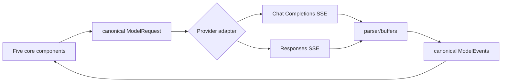

### 8.2 Capability profile，而不是到处判断 URL

`ProviderCapabilities` 描述 API mode、tools、parallel、usage、thinking toggle、reasoning effort/replay、
structured output protocol。Composition 阶段解析一次，adapter 根据 capability 决定是否发送字段。

DeepSeek Chat 的 thinking 可能要求下一次 tool continuation replay reasoning；Responses 的 reasoning
可能包含 encrypted opaque state；普通 Chat provider 可能两者都不支持。核心 state 仍只保存
`ReasoningItem`，差异停在 adapter。

### 8.3 Chat Completions 增量组装

```text
delta.content                  -> ModelTextDelta
delta.reasoning_content        -> ModelReasoningDelta
delta.tool_calls[index].id     -> call buffer
delta.tool_calls[index].name   -> call buffer
delta.tool_calls[index].args   -> append fragment
usage                          -> ModelUsage
finish_reason / [DONE]         -> authoritative completion
```

参数 `'{'`、`'"city"'`、`':"北京"}'` 必须按 call index 拼完整后再 `json.loads`。失败也生成带
`raw_arguments/parse_error` 的 ToolCall，交给 Executor 形成可观察错误，而不是在 adapter 丢失 call。

### 8.4 Responses 事件

```text
response.output_text.delta
response.reasoning_summary_text.delta
response.function_call_arguments.delta
response.output_item.done
response.completed
```

`response.completed` 是成功的权威标记；收到后不应等待 peer 关闭。连接关闭但没出现 terminal 必须是
protocol error，不能把半截正文当答案。Reasoning encrypted content 只可原样保存/replay，不能解析或
与用户可见 summary 混存。

### 8.5 重试边界

自动重试只能发生在还没有发出用户可见/业务相关增量时：

```python
attempt = 0
while True:
    emitted_data = False
    try:
        async for event in stream_once(...):
            emitted_data |= isinstance(event, (TextDelta, ReasoningDelta))
            yield event
        return
    except ModelError as exc:
        if emitted_data or not exc.retryable or attempt >= max_retries:
            raise
        attempt += 1
        delay = exc.retry_after or exponential_backoff(attempt)
        yield ModelRetrying(attempt, max_retries, delay, str(exc))
        await sleep(delay)
```

401、429、context window、5xx、transport、protocol 应映射为不同 error kind，并解析 `Retry-After`。
输出总字符也有硬上限，防止异常服务无限流。

### 8.6 RuntimeEvent 是 UI 公共协议

| 类型 | 例子 | UI 行为 |
| --- | --- | --- |
| 生命周期 | TurnStarted/Completed/Failed/Cancelled | 打开/关闭 Turn 展示 |
| 模型 | AssistantTextDelta/ReasoningDelta | 增量渲染不同区域 |
| 工具 | ToolCallStarted/OutputDelta/Completed | 工具卡片与输出 |
| 控制 | PlanUpdated/ContextCompacted | 更新计划与提示 |
| 遥测 | TokenUsageUpdated/ModelRetryScheduled | 状态栏/诊断 |

不要 emit 字符串再让 CLI 正则解析。typed event 让 CLI、WebSocket、测试和日志独立消费，且都不能影响
Graph 路由。

### 8.7 离线协议测试

用 `httpx.MockTransport`/fake SSE 覆盖：逐字符 text/reasoning、多个 call 参数交错、非法 arguments、
usage 尾包、401/429/5xx、缺 terminal、未知 finish、Responses incomplete、完成后 peer 不关闭、delta
发出后不重试、DeepSeek reasoning replay。正常回归不能依赖 API key 和真实网络。

### 8.8 最小可运行 OpenAI-compatible adapter

下面 adapter 可替换 10.9 的 ScriptedModel，使执行骨架真正调用 Chat Completions。先在依赖中加入
`httpx>=0.28,<1`。它只支持正文和 function tools，不含 retry、usage、thinking 和多模态；这些生产增强
仍按 8.2–8.7 实现。它依赖 10.9 的 canonical 类型；复制运行时先完成 10.9，再添加以下文件。

```python
# openai_chat.py
from __future__ import annotations

import json
from dataclasses import dataclass
from uuid import uuid4

import httpx

from mini_agent import (
    AssistantItem, ModelCompleted, ModelRequest, TextDelta,
    ToolCall, ToolCallItem, ToolResultItem, UserItem,
)


@dataclass(slots=True)
class CallBuffer:
    id: str = ""
    name: str = ""
    arguments: str = ""


def to_messages(request: ModelRequest) -> list[dict[str, object]]:
    messages: list[dict[str, object]] = [
        {"role": "system", "content": request.instructions}
    ]
    index = 0
    while index < len(request.items):
        item = request.items[index]
        if isinstance(item, UserItem):
            messages.append({"role": "user", "content": item.content})
        elif isinstance(item, AssistantItem):
            messages.append({"role": "assistant", "content": item.content})
        elif isinstance(item, ToolCallItem):
            calls = []
            while index < len(request.items) and isinstance(
                request.items[index], ToolCallItem
            ):
                call = request.items[index].call
                calls.append({
                    "id": call.id,
                    "type": "function",
                    "function": {
                        "name": call.name,
                        "arguments": json.dumps(call.arguments or {}, ensure_ascii=False),
                    },
                })
                index += 1
            messages.append({
                "role": "assistant",
                "content": None,
                "tool_calls": calls,
            })
            continue
        elif isinstance(item, ToolResultItem):
            messages.append({
                "role": "tool", "tool_call_id": item.call_id,
                "name": item.tool_name, "content": item.content,
            })
        index += 1
    return messages


class OpenAIChatModel:
    def __init__(
        self, *, api_key: str, base_url: str, model: str,
        transport: httpx.AsyncBaseTransport | None = None,
    ) -> None:
        if not api_key:
            raise ValueError("api_key must not be empty")
        self.api_key = api_key
        self.base_url = base_url.rstrip("/")
        self.model = model
        # transport 只用于离线协议测试；生产环境保持 None。
        self.client = httpx.AsyncClient(timeout=120, transport=transport)

    async def stream(self, request: ModelRequest):
        payload = {
            "model": self.model,
            "messages": to_messages(request),
            "stream": True,
        }
        tools = [
            {"type": "function", "function": {
                "name": spec.name,
                "description": spec.description,
                "parameters": dict(spec.parameters),
            }}
            for spec in request.tools
        ]
        if tools:
            payload["tools"] = tools
        text: list[str] = []
        calls: dict[int, CallBuffer] = {}
        terminal = False
        async with self.client.stream(
            "POST",
            f"{self.base_url}/chat/completions",
            headers={"Authorization": f"Bearer {self.api_key}"},
            json=payload,
        ) as response:
            if response.is_error:
                body = (await response.aread()).decode(errors="replace")[:4_000]
                raise RuntimeError(f"provider HTTP {response.status_code}: {body}")
            async for line in response.aiter_lines():
                if not line.startswith("data:"):
                    continue
                data = line[5:].strip()
                if not data:
                    continue
                if data == "[DONE]":
                    terminal = True
                    break
                try:
                    packet = json.loads(data)
                except json.JSONDecodeError as exc:
                    raise RuntimeError("invalid SSE JSON") from exc
                choices = packet.get("choices") or []
                if not choices:
                    continue
                choice = choices[0]
                finish = choice.get("finish_reason")
                if finish is not None:
                    if finish not in {"stop", "tool_calls"}:
                        raise RuntimeError(f"unsupported finish reason: {finish}")
                    terminal = True
                delta = choice.get("delta") or {}
                content = delta.get("content")
                if isinstance(content, str) and content:
                    text.append(content)
                    yield TextDelta(content)
                for raw in delta.get("tool_calls") or []:
                    index = int(raw.get("index", 0))
                    buffer = calls.setdefault(index, CallBuffer())
                    if raw.get("id"):
                        buffer.id = str(raw["id"])
                    function = raw.get("function") or {}
                    if function.get("name"):
                        buffer.name += str(function["name"])
                    if function.get("arguments"):
                        buffer.arguments += str(function["arguments"])
                if finish is not None:
                    break
        if not terminal:
            raise RuntimeError("stream ended without a completion marker")

        items: list[AssistantItem | ToolCallItem] = []
        if text:
            items.append(AssistantItem("".join(text)))
        for _, buffer in sorted(calls.items()):
            parse_error = None
            arguments = None
            try:
                value = json.loads(buffer.arguments or "{}")
                if not isinstance(value, dict):
                    raise ValueError("tool arguments must be an object")
                arguments = value
            except (json.JSONDecodeError, ValueError) as exc:
                parse_error = str(exc)
            items.append(ToolCallItem(ToolCall(
                buffer.id or str(uuid4()), buffer.name, arguments, parse_error
            )))
        yield ModelCompleted(tuple(items))

    async def aclose(self) -> None:
        await self.client.aclose()
```

一个不会执行 shell 的受限代码读取 Tool：

```python
# read_file.py
from pathlib import Path

from mini_agent import ToolCall, ToolResult, ToolSpec


class ReadFileTool:
    def __init__(self, project_root: Path, max_bytes: int = 200_000) -> None:
        self.root = project_root.resolve()
        self.max_bytes = max_bytes

    @property
    def spec(self):
        return ToolSpec(
            "read_file",
            "Read one UTF-8 text file inside the current project.",
            {"type": "object", "properties": {"path": {"type": "string"}},
             "required": ["path"], "additionalProperties": False},
        )

    async def execute(self, call: ToolCall) -> ToolResult:
        assert call.arguments is not None
        target = (self.root / str(call.arguments["path"])).resolve(strict=True)
        target.relative_to(self.root)  # 路径逃逸时抛 ValueError
        if not target.is_file():
            raise ValueError("path is not a regular file")
        data = target.read_bytes()
        if len(data) > self.max_bytes:
            raise ValueError("file exceeds read budget")
        return ToolResult(call.id, call.name, data.decode("utf-8"))
```

组装真实纵切面：

```python
import os
from pathlib import Path

from mini_agent import MiniHarness, Registry
from openai_chat import OpenAIChatModel
from read_file import ReadFileTool


async def build_agent():
    root = Path.cwd().resolve()
    registry = Registry()
    registry.register(ReadFileTool(root))
    model = OpenAIChatModel(
        api_key=os.environ["MINI_AGENT_API_KEY"],
        base_url=os.environ.get("MINI_AGENT_BASE_URL", "https://api.openai.com/v1"),
        model=os.environ["MINI_AGENT_MODEL"],
    )
    return MiniHarness(model, registry)
```

先用假 SSE 验证 wire protocol，不要拿真实 API 当单元测试：

```python
# tests/test_openai_chat.py
import asyncio
import json

import httpx
import pytest

from mini_agent import AssistantItem, ModelRequest, TextDelta, ToolCallItem, ToolSpec
from openai_chat import OpenAIChatModel


def test_stream_assembles_fragmented_tool_arguments():
    async def handler(request: httpx.Request) -> httpx.Response:
        assert request.url.path == "/v1/chat/completions"
        assert request.headers["authorization"] == "Bearer test-key"
        payload = __import__("json").loads(request.content)
        assert payload["stream"] is True
        assert payload["tools"][0]["function"]["name"] == "read_file"
        body = b"".join([
            b'data: {"choices":[{"delta":{"tool_calls":[{"index":0,',
            b'"id":"c1","function":{"name":"read_file",',
            b'"arguments":"{\\\"path\\\":"}}]},"finish_reason":null}]}\n\n',
            b'data: {"choices":[{"delta":{"tool_calls":[{"index":0,',
            b'"function":{"arguments":"\\\"README.md\\\"}"}}]},',
            b'"finish_reason":"tool_calls"}]}\n\n',
            b'data: [DONE]\n\n',
        ])
        return httpx.Response(200, content=body, headers={
            "content-type": "text/event-stream"
        })

    async def scenario():
        model = OpenAIChatModel(
            api_key="test-key", base_url="https://example.test/v1",
            model="test-model", transport=httpx.MockTransport(handler),
        )
        request = ModelRequest(
            "Be careful.", (),
            (ToolSpec("read_file", "Read a file.", {
                "type": "object", "properties": {
                    "path": {"type": "string"}
                }, "required": ["path"], "additionalProperties": False,
            }),),
        )
        try:
            events = [event async for event in model.stream(request)]
        finally:
            await model.aclose()
        assert not any(isinstance(event, TextDelta) for event in events)
        call_item = events[-1].items[0]
        assert isinstance(call_item, ToolCallItem)
        assert call_item.call.id == "c1"
        assert call_item.call.name == "read_file"
        assert call_item.call.arguments == {"path": "README.md"}

    asyncio.run(scenario())


def test_text_and_interleaved_calls_are_normalized():
    def sse(*packets):
        return "".join(
            f"data: {json.dumps(packet)}\n\n" for packet in packets
        ).encode()

    async def text_handler(request):
        del request
        return httpx.Response(200, content=sse({
            "choices": [{"delta": {"content": "hello"}, "finish_reason": "stop"}]
        }))

    async def calls_handler(request):
        del request
        first = {"choices": [{"delta": {"tool_calls": [
            {"index": 0, "id": "a", "function": {
                "name": "echo", "arguments": "{\"value\":"
            }},
            {"index": 1, "id": "b", "function": {
                "name": "echo", "arguments": "{\"value\":"
            }},
        ]}, "finish_reason": None}]}
        second = {"choices": [{"delta": {"tool_calls": [
            {"index": 0, "function": {"arguments": "1}"}},
            {"index": 1, "function": {"arguments": "2}"}},
        ]}, "finish_reason": "tool_calls"}]}
        return httpx.Response(200, content=sse(first, second))

    async def collect(handler, tools=()):
        model = OpenAIChatModel(
            api_key="key", base_url="https://example.test/v1", model="m",
            transport=httpx.MockTransport(handler),
        )
        try:
            return [event async for event in model.stream(
                ModelRequest("system", (), tools)
            )]
        finally:
            await model.aclose()

    text_events = asyncio.run(collect(text_handler))
    assert isinstance(text_events[0], TextDelta)
    assert text_events[-1].items == (AssistantItem("hello"),)

    echo = ToolSpec("echo", "Echo a value.", {"type": "object"})
    call_events = asyncio.run(collect(calls_handler, (echo,)))
    calls = [item.call for item in call_events[-1].items]
    assert [(call.id, call.arguments) for call in calls] == [
        ("a", {"value": 1}), ("b", {"value": 2})
    ]


def test_protocol_and_http_failures_are_explicit():
    async def collect(body: bytes, status: int = 200):
        async def handler(request):
            del request
            return httpx.Response(status, content=body)

        model = OpenAIChatModel(
            api_key="key", base_url="https://example.test/v1", model="m",
            transport=httpx.MockTransport(handler),
        )
        try:
            return [event async for event in model.stream(
                ModelRequest("system", (), ())
            )]
        finally:
            await model.aclose()

    cases = [
        (b"data: not-json\n\n", "invalid SSE JSON"),
        (b'data: {"choices":[{"delta":{"content":"half"},'
         b'"finish_reason":null}]}\n\n', "without a completion marker"),
        (b'data: {"choices":[{"delta":{},"finish_reason":"length"}]}\n\n',
         "unsupported finish reason"),
    ]
    for body, message in cases:
        with pytest.raises(RuntimeError, match=message):
            asyncio.run(collect(body))
    for status in (401, 429, 500):
        with pytest.raises(RuntimeError, match=f"provider HTTP {status}"):
            asyncio.run(collect(b"failure", status))


def test_read_file_rejects_path_escape(tmp_path):
    from mini_agent import Executor, Registry, ToolCall
    from read_file import ReadFileTool

    project = tmp_path / "project"
    project.mkdir()
    (tmp_path / "secret.txt").write_text("secret")
    registry = Registry()
    registry.register(ReadFileTool(project))
    result = asyncio.run(Executor(registry).execute(
        ToolCall("c1", "read_file", {"path": "../secret.txt"})
    ))

    assert result.is_error
    assert "ValueError" in result.content
```

这已经能让真实模型选择并读取项目文件，但仍只应在临时测试项目中运行。接着实现 Corki adapter 的
error taxonomy、retry、usage、reasoning、响应上限与 Responses mode；不要直接把这个最小版本标成
生产可靠。

---

## 九、Skills、MCP 与 Plugin

### 9.1 三者扩展的对象不同

| 扩展 | 本质 | 主要进入哪个核心组件 |
| --- | --- | --- |
| Skill | 指令、references、scripts、assets 的知识包 | Context；按指令使用普通 Tool |
| MCP | 进程/HTTP 服务暴露的标准工具、资源、prompt | Tool Use；catalog 也进入 Context |
| Plugin | 打包 Skill、MCP、可信 Python Tool 的本地交付单元 | Composition 阶段组合两条入口 |

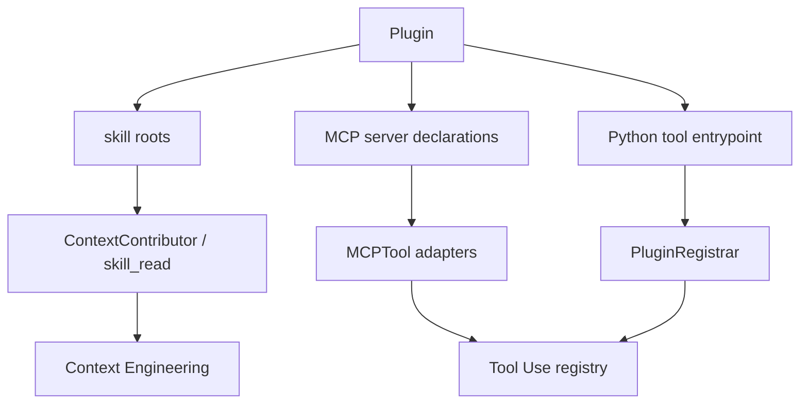

它们不能另建一个隐藏模型循环，否则 planning、memory、state 和恢复契约都会被绕过。

### 9.2 Skill 怎样被发现和调用

一个 Skill 至少有：

```markdown
---
name: paper-search
description: Search for recent academic papers and synthesize evidence.
---

Detailed workflow...
```

`SkillService` 按 project（近 cwd 优先）、user、compatibility、bundled system、namespaced plugin roots
发现；同 qualified name 保留优先级更高者。Snapshot 用 path/mtime/size fingerprint 缓存。

调用是渐进披露：

```text
每轮：只注入 name + description + scope + path 的有界 catalog
用户明确 $paper-search：注入所选 SKILL.md 正文
模型自主选择：调用 skill_read(name/file)
后续 reference/script：相对 skill root 按需读取
```

读取拒绝绝对路径和 `..`，并限制 128 KiB。Skill 指令告诉模型怎样做，真正搜索/读写仍通过普通工具，
所以 Observation、历史、checkpoint 都不变。

### 9.3 MCP 怎样成为普通候选工具

`MCPManager` 对每个 server initialize、分页 `tools/list`，将 definition 适配为 `MCPTool`，名称是
`mcp__<server>__<remote>`。readOnlyHint 映射 parallel，其余默认 exclusive。

Manager 先 staging 所有易失败 discovery，再 publish 到 Registry：取消/全局发布失败会反向 unregister
并关闭 clients，单个可选 server 的普通连接错误只记录 warning。这样不会留下“schema 已曝光但连接
不存在”的 ghost tool。

MCP Tool 执行后将 text、structuredContent、受限 image 转成 ToolResult。因此第 4 章天气示例与内置
工具完全走同一 Executor、ledger、history 和 StateGraph。

### 9.4 Plugin 怎样组合能力

Plugin manifest 支持 `.corki-plugin/plugin.toml` 和兼容 `.codex-plugin/plugin.json`，可声明 skill path、
MCP servers、`file.py:function` entrypoint。Python plugin 是明确可信的本地代码，不是 sandbox。

`PluginRegistrar.register_tool()` 只暴露窄接口，自动添加 `plugin__name__tool` namespace、限制字段长度、
规范结果。注册函数中途失败时撤销该 plugin 所有工具并移除临时 module。Plugin 不应获得 Graph 或
SQLite connection；否则它能绕过核心不变量。

### 9.5 Composition 与关闭顺序

```text
register built-ins
 -> discover/load plugins（得到 skill roots/MCP declarations/tools）
 -> build SkillService and ContextContributors
 -> start/stage MCP tools
 -> compile graph/checkpointer
 -> seal Registry
 -> serve turns
```

关闭大致反序：停止 graph/进程，等待 memory，关闭 MCP/plugin/model/repository/checkpointer。每项 close
即使前一项失败也应继续，最后报告错误。测试名称冲突、路径逃逸、超大资源、MCP 分页/启动取消、plugin
部分注册回滚、重复 close、seal 后注册失败。

---

## 十、从零实现路线与测试

这一章把前面知识变成工程顺序。不要复制 Corki 全部文件；每个阶段完成一个可运行纵切面，通过验收后
再增加下一层。

### 10.1 项目骨架与依赖方向

```text
mini_agent/
├── pyproject.toml
├── prompts/
├── src/mini_agent/
│   ├── protocol/        # canonical 数据；只依赖标准库
│   ├── planning/        # plan value objects
│   ├── evaluation/      # 纯路由规则
│   ├── memory/          # memory ports/pipeline
│   ├── tools/           # Registry/Executor/Tool adapters
│   ├── prompting/       # PromptStore/Assembler
│   ├── context/         # Builder/History/Window
│   ├── models/          # ModelPort/provider adapters
│   ├── sessions/        # repository port
│   ├── storage/         # SQLite adapter
│   ├── core/            # state/graph/runtime
│   └── cli/             # 最外层 renderer/input
└── tests/
    ├── unit/
    ├── integration/
    └── e2e/
```

内层不 import 外层：protocol 不知道 LangGraph；graph 不知道 OpenAI 和 Rich；provider 不操作 SQLite；
CLI 不决定路由。最小依赖从 Python、LangGraph、pytest 开始，真实 HTTP/SQLite checkpoint/终端库按阶段加。

### 10.2 Milestone 0：canonical 协议

实现 ID、ConversationItem union、ToolSpec/Call/Result、ModelRequest/Event、RuntimeEvent，并写显式
`item_kind/to_payload/from_payload`。

验收：`user -> reasoning -> tool call -> tool result -> assistant` JSON round-trip 后类型、ID、顺序相同；
protocol package 只 import 标准库。

### 10.3 Milestone 1：纯聊天流

实现 `ModelPort` 和 ScriptedModel，再建：

```text
START -> call_model -> finalize -> END
```

ScriptedModel 记录每个 request，按脚本产出 TextDelta/Completed。Runtime 使用有界 queue，将节点事件
转成 async iterator。

验收：无网络得到 `TurnStarted -> TextDelta* -> TurnCompleted`；stream 没有 Completed 时失败，半截
文本不能当完成。

### 10.4 Milestone 2：Planning + Tool ReAct 闭环

实现 Tool Protocol、Registry、Executor、`update_plan` 和一个 `add(a,b)` 工具；增加 evaluate/tool/fail：

```text
call_model -> evaluate -> execute_tools -> call_model
                      \-> finalize/fail
```

FakeModel 第一次返回 add call，第二次先断言 history 末尾是对应 ToolResultItem，再回答 42。随后增加
plan state update、Step/Call 上限、parallel/exclusive 批次。

验收：未知工具、畸形 JSON、缺字段、handler 异常都作为 Observation 回到模型；模型未见过的 frozen
tool 不可执行；plan 最多一个 in_progress。

### 10.5 Milestone 3：Context + 短期 Memory

新增 prepare 节点，确保工具后回到 prepare 而非直接 call_model。实现 PromptStore、Contribution、
Assembler、Builder、append-only repository、active_history 和 stable-key delta。

验收：ContextItem 在当前 UserItem 之前；未变化不重复 append；修改/删除产生新版本/tombstone；工具
修改项目后下一 Step 看见新 Git snapshot；完整 tool call/result 成对召回。

### 10.6 Milestone 4：单一真实 Provider + 最小 CLI

先把 item→wire、packet→buffer、buffer→canonical 写成纯函数并离线测试，再接一种 SSE API mode。
CLI 只读取输入和渲染 RuntimeEvent。此时学生已经拥有一个可以真实交互、读项目和调用工具的 Coding
Agent；后续阶段是在这个纵切面上增加可靠性，而不是等到最后才第一次可用。

`pyproject.toml` 命令入口：

```toml
[project.scripts]
mini-agent = "mini_agent.cli:main"
```

editable install 会在当前虚拟环境生成 console script；命令映射不是 shell 固定行为。

验收：离线 provider fixtures 全通过；显式 online smoke test 能完成一轮工具调用；安装后
`mini-agent` 可进入会话，Ctrl+C 能退出。正常 pytest 不依赖 API key。

### 10.7 Milestone 5：State checkpoint 与业务幂等

创建业务表：threads、turns、conversation_items、model_steps、tool_executions；再接 LangGraph SQLite
checkpointer。model step 与 canonical items 同事务提交；重复相同 ID/payload 幂等，不同 payload 报
integrity error。教学实现应在 tool ledger 保存规范化 arguments/hash，补上当前 Corki 的已知边界。

验收：分别在 model commit、tool complete 后、graph checkpoint 前故障退出，用新 Runtime resume；
FakeModel/handler 调用次数没有增加。

### 10.8 Milestone 6：压缩、长期 Memory 与扩展

先做 request estimator/output truncation 和 CompactionItem；再做一个最小长期记忆版本：
`memories(id,text,source_thread,updated_at)` + 显式写入 + 关键词检索 Tool + token 上限。理解 read path 后，
再升级为 Corki Phase 1/2 lease/digest pipeline，最后接 Skill、MCP、Plugin。

验收：强制小窗口压缩时当前输入逐字不变、call/result 不拆；最小 memory 能跨 Thread 关键词检索且
有来源/预算；生产增强中 lease 过期可接管但旧 owner 不能提交，非法 consolidation 保留旧 artifacts；
任一可选扩展失败不破坏普通 Turn。

### 10.9 可复制运行的 ReAct 六节点执行骨架

下面先给一个**可运行的执行骨架**。为了能在一个文件内看完，它暂时采用单文件；理解后按 10.1 的目录拆包。
它使用 ScriptedModel，不访问网络，真实运行 LangGraph 六节点、预设 ToolCall、Observation 回灌和
typed event stream。它不是完整五组件成品：真实 Provider 见 8.8，跨 Thread Memory 见 3.11，持久化与
恢复见 10.10；生产级 Context/Planning 则必须继续按第 2、5 章拆成独立组件。

`pyproject.toml`：

```toml
[build-system]
requires = ["hatchling>=1.25"]
build-backend = "hatchling.build"

[project]
name = "mini-agent"
version = "0.1.0"
requires-python = ">=3.11"
dependencies = ["langgraph>=1.2,<2"]

[project.optional-dependencies]
dev = ["pytest>=8,<9"]

[project.scripts]
mini-agent = "mini_agent:main"

[tool.hatch.build.targets.wheel]
packages = ["src/mini_agent"]
```

`src/mini_agent/__init__.py`：

```python
from __future__ import annotations

import asyncio
from collections.abc import AsyncIterator, Mapping
from dataclasses import dataclass
from typing import Any, Protocol, TypedDict
from uuid import uuid4

from langgraph.graph import END, START, StateGraph
from langgraph.runtime import Runtime


# ---------- Canonical protocol ----------

@dataclass(frozen=True, slots=True)
class UserItem:
    content: str


@dataclass(frozen=True, slots=True)
class AssistantItem:
    content: str


@dataclass(frozen=True, slots=True)
class ToolCall:
    id: str
    name: str
    arguments: Mapping[str, Any] | None
    parse_error: str | None = None


@dataclass(frozen=True, slots=True)
class ToolCallItem:
    call: ToolCall


@dataclass(frozen=True, slots=True)
class ToolResultItem:
    call_id: str
    tool_name: str
    content: str
    is_error: bool = False


Item = UserItem | AssistantItem | ToolCallItem | ToolResultItem


@dataclass(frozen=True, slots=True)
class ToolSpec:
    name: str
    description: str
    parameters: Mapping[str, Any]


@dataclass(frozen=True, slots=True)
class ToolResult:
    call_id: str
    tool_name: str
    content: str
    is_error: bool = False


@dataclass(frozen=True, slots=True)
class ModelRequest:
    instructions: str
    items: tuple[Item, ...]
    tools: tuple[ToolSpec, ...]


@dataclass(frozen=True, slots=True)
class TextDelta:
    text: str


@dataclass(frozen=True, slots=True)
class ModelCompleted:
    items: tuple[AssistantItem | ToolCallItem, ...]


ModelEvent = TextDelta | ModelCompleted


class ModelPort(Protocol):
    def stream(self, request: ModelRequest) -> AsyncIterator[ModelEvent]: ...

    async def aclose(self) -> None: ...


BASE_PROMPT = """You are a coding agent working in the user's current project.
Use only tools present in this request; never invent tool names or results.
Treat tool results as observations and revise your approach when evidence disagrees.
For multi-step work, maintain a short plan with at most one active step.
Inspect before editing, verify meaningful changes, and stop when the task is resolved.
"""


# ---------- Tool boundary ----------

class Tool(Protocol):
    @property
    def spec(self) -> ToolSpec: ...

    async def execute(self, call: ToolCall) -> ToolResult: ...


class Registry:
    def __init__(self) -> None:
        self._tools: dict[str, Tool] = {}
        self._sealed = False

    def register(self, tool: Tool) -> None:
        if self._sealed:
            raise RuntimeError("registry is sealed")
        if tool.spec.name in self._tools:
            raise ValueError(f"duplicate tool: {tool.spec.name}")
        self._tools[tool.spec.name] = tool

    def seal(self) -> None:
        self._sealed = True

    def specs(self) -> tuple[ToolSpec, ...]:
        return tuple(tool.spec for tool in self._tools.values())

    def get(self, name: str) -> Tool | None:
        return self._tools.get(name)


def validate(value: object, schema: Mapping[str, Any], path: str = "arguments") -> None:
    expected = schema.get("type")
    types: dict[str, type | tuple[type, ...]] = {
        "object": Mapping,
        "array": list,
        "string": str,
        "integer": int,
        "number": (int, float),
        "boolean": bool,
    }
    if isinstance(expected, str) and expected in types:
        if not isinstance(value, types[expected]) or (
            expected in {"integer", "number"} and isinstance(value, bool)
        ):
            raise ValueError(f"{path} must be {expected}")
    if "enum" in schema and value not in schema["enum"]:
        raise ValueError(f"{path} must be one of {schema['enum']}")
    if isinstance(value, Mapping):
        properties = schema.get("properties", {})
        missing = [key for key in schema.get("required", []) if key not in value]
        if missing:
            raise ValueError(f"{path} missing: {', '.join(missing)}")
        if schema.get("additionalProperties") is False:
            extras = set(value).difference(properties)
            if extras:
                raise ValueError(f"{path} unknown fields: {', '.join(sorted(extras))}")
        for key, child_value in value.items():
            child_schema = properties.get(key)
            if isinstance(child_schema, Mapping):
                validate(child_value, child_schema, f"{path}.{key}")
    if isinstance(value, list) and isinstance(schema.get("items"), Mapping):
        for index, item in enumerate(value):
            validate(item, schema["items"], f"{path}[{index}]")
        if len(value) < schema.get("minItems", 0):
            raise ValueError(f"{path} has too few items")
        if "maxItems" in schema and len(value) > schema["maxItems"]:
            raise ValueError(f"{path} has too many items")


class Executor:
    def __init__(self, registry: Registry) -> None:
        self._registry = registry

    async def execute(self, call: ToolCall) -> ToolResult:
        tool = self._registry.get(call.name)
        if tool is None:
            return ToolResult(call.id, call.name, "unknown tool", True)
        if call.parse_error or call.arguments is None:
            return ToolResult(call.id, call.name, "invalid arguments", True)
        try:
            validate(call.arguments, tool.spec.parameters)
            result = await tool.execute(call)
        except Exception as exc:
            return ToolResult(call.id, call.name, f"{type(exc).__name__}: {exc}", True)
        if result.call_id != call.id or result.tool_name != call.name:
            return ToolResult(call.id, call.name, "result identity mismatch", True)
        return result


class AddTool:
    @property
    def spec(self) -> ToolSpec:
        return ToolSpec(
            "add",
            "Add two integers.",
            {
                "type": "object",
                "properties": {"a": {"type": "integer"}, "b": {"type": "integer"}},
                "required": ["a", "b"],
                "additionalProperties": False,
            },
        )

    async def execute(self, call: ToolCall) -> ToolResult:
        assert call.arguments is not None
        value = int(call.arguments["a"]) + int(call.arguments["b"])
        return ToolResult(call.id, call.name, str(value))


# ---------- Model fake ----------

class ScriptedModel:
    def __init__(self, responses: list[ModelCompleted]) -> None:
        self._responses = responses
        self.requests: list[ModelRequest] = []

    async def stream(self, request: ModelRequest) -> AsyncIterator[ModelEvent]:
        self.requests.append(request)
        if not self._responses:
            raise RuntimeError("model script exhausted")
        completed = self._responses.pop(0)
        for item in completed.items:
            if isinstance(item, AssistantItem):
                for character in item.content:
                    yield TextDelta(character)
        yield completed

    async def aclose(self) -> None:
        pass


# ---------- Typed UI events ----------

@dataclass(frozen=True, slots=True)
class TurnStarted:
    turn_id: str


@dataclass(frozen=True, slots=True)
class AssistantDelta:
    text: str


@dataclass(frozen=True, slots=True)
class ToolStarted:
    name: str


@dataclass(frozen=True, slots=True)
class ToolCompleted:
    name: str
    is_error: bool


@dataclass(frozen=True, slots=True)
class TurnCompleted:
    answer: str


@dataclass(frozen=True, slots=True)
class TurnFailed:
    error: str


@dataclass(frozen=True, slots=True)
class TurnCancelled:
    pass


Event = (
    TurnStarted | AssistantDelta | ToolStarted | ToolCompleted
    | TurnCompleted | TurnFailed | TurnCancelled
)


class EventSink(Protocol):
    async def emit(self, event: Event) -> None: ...


@dataclass(frozen=True, slots=True)
class RunContext:
    events: EventSink


class QueueSink:
    def __init__(self, queue: asyncio.Queue[Event]) -> None:
        self._queue = queue

    async def emit(self, event: Event) -> None:
        await self._queue.put(event)


# ---------- LangGraph work state ----------

class AgentState(TypedDict):
    turn_id: str
    pending: tuple[UserItem, ...]
    history: tuple[Item, ...]
    request_items: tuple[Item, ...]
    request_tools: tuple[ToolSpec, ...]
    last_model_items: tuple[AssistantItem | ToolCallItem, ...]
    step_count: int
    tool_call_count: int
    route: str
    status: str
    answer: str | None
    error: str | None


class MiniHarness:
    def __init__(
        self, model: ModelPort, registry: Registry, *, max_steps: int = 8,
        max_tool_calls: int = 16,
    ) -> None:
        self.model = model
        self.registry = registry
        self.executor = Executor(registry)
        self.max_steps = max_steps
        self.max_tool_calls = max_tool_calls
        registry.seal()
        self.graph = self._compile()

    def _compile(self):
        graph = StateGraph(AgentState, context_schema=RunContext)
        graph.add_node("prepare", self._prepare)
        graph.add_node("model", self._model)
        graph.add_node("evaluate", self._evaluate)
        graph.add_node("tools", self._tools)
        graph.add_node("finalize", self._finalize)
        graph.add_node("fail", self._fail)
        graph.add_edge(START, "prepare")
        graph.add_edge("prepare", "model")
        graph.add_edge("model", "evaluate")
        graph.add_conditional_edges(
            "evaluate", lambda state: state["route"],
            {"tools": "tools", "finalize": "finalize", "fail": "fail"},
        )
        graph.add_edge("tools", "prepare")
        graph.add_edge("finalize", END)
        graph.add_edge("fail", END)
        return graph.compile()

    async def _prepare(self, state: AgentState) -> dict[str, object]:
        history = (*state["history"], *state["pending"])
        return {
            "history": history,
            "request_items": history,
            "request_tools": self.registry.specs(),
            "pending": (),
            "status": "running",
        }

    async def _model(
        self, state: AgentState, runtime: Runtime[RunContext]
    ) -> dict[str, object]:
        completed: ModelCompleted | None = None
        request = ModelRequest(
            BASE_PROMPT,
            state["request_items"],
            state["request_tools"],
        )
        async for event in self.model.stream(request):
            if isinstance(event, TextDelta):
                await runtime.context.events.emit(AssistantDelta(event.text))
            else:
                completed = event
        if completed is None:
            raise RuntimeError("stream ended without ModelCompleted")
        return {
            "history": (*state["history"], *completed.items),
            "last_model_items": completed.items,
            "step_count": state["step_count"] + 1,
        }

    async def _evaluate(self, state: AgentState) -> dict[str, object]:
        calls = [i for i in state["last_model_items"] if isinstance(i, ToolCallItem)]
        text = "".join(
            i.content for i in state["last_model_items"] if isinstance(i, AssistantItem)
        ).strip()
        ids = [item.call.id for item in calls]
        if len(ids) != len(set(ids)):
            return {"route": "fail", "error": "duplicate tool call ids"}
        if state["step_count"] >= self.max_steps and calls:
            return {"route": "fail", "error": "step limit reached"}
        if state["tool_call_count"] + len(calls) > self.max_tool_calls:
            return {"route": "fail", "error": "tool call limit reached"}
        if calls:
            return {"route": "tools", "error": None}
        if text:
            return {"route": "finalize", "error": None}
        return {"route": "fail", "error": "empty model output"}

    async def _tools(
        self, state: AgentState, runtime: Runtime[RunContext]
    ) -> dict[str, object]:
        calls = [i.call for i in state["last_model_items"] if isinstance(i, ToolCallItem)]
        advertised = {spec.name for spec in state["request_tools"]}
        results: list[ToolResultItem] = []
        for call in calls:
            await runtime.context.events.emit(ToolStarted(call.name))
            result = (
                await self.executor.execute(call)
                if call.name in advertised
                else ToolResult(call.id, call.name, "tool was not advertised", True)
            )
            results.append(
                ToolResultItem(result.call_id, result.tool_name, result.content, result.is_error)
            )
            await runtime.context.events.emit(ToolCompleted(call.name, result.is_error))
        return {
            "history": (*state["history"], *results),
            "tool_call_count": state["tool_call_count"] + len(calls),
        }

    async def _finalize(self, state: AgentState) -> dict[str, object]:
        answer = "".join(
            i.content for i in state["last_model_items"] if isinstance(i, AssistantItem)
        )
        return {"status": "completed", "answer": answer}

    async def _fail(self, state: AgentState) -> dict[str, object]:
        return {"status": "failed", "answer": None}

    async def aclose(self) -> None:
        await self.model.aclose()

    async def __aenter__(self) -> "MiniHarness":
        return self

    async def __aexit__(self, exc_type, exc, traceback) -> None:
        await self.aclose()

    async def stream(self, text: str) -> AsyncIterator[Event]:
        turn_id = str(uuid4())
        initial: AgentState = {
            "turn_id": turn_id,
            "pending": (UserItem(text),),
            "history": (),
            "request_items": (),
            "request_tools": (),
            "last_model_items": (),
            "step_count": 0,
            "tool_call_count": 0,
            "route": "",
            "status": "created",
            "answer": None,
            "error": None,
        }
        yield TurnStarted(turn_id)
        queue: asyncio.Queue[Event] = asyncio.Queue(maxsize=8)
        done = asyncio.Event()
        result_box: list[AgentState] = []
        error_box: list[BaseException] = []

        async def produce() -> None:
            try:
                result = await self.graph.ainvoke(
                    initial, context=RunContext(QueueSink(queue)),
                    config={"recursion_limit": 50},
                )
                result_box.append(result)
            except BaseException as exc:
                error_box.append(exc)
            finally:
                done.set()

        task = asyncio.create_task(produce())
        try:
            while not done.is_set() or not queue.empty():
                if not queue.empty():
                    yield queue.get_nowait()
                    continue
                event_waiter = asyncio.create_task(queue.get())
                done_waiter = asyncio.create_task(done.wait())
                finished, pending = await asyncio.wait(
                    (event_waiter, done_waiter), return_when=asyncio.FIRST_COMPLETED
                )
                for waiter in pending:
                    waiter.cancel()
                await asyncio.gather(*pending, return_exceptions=True)
                if event_waiter in finished:
                    yield event_waiter.result()
            await task
            if error_box:
                error = error_box[0]
                if isinstance(error, asyncio.CancelledError):
                    yield TurnCancelled()
                    raise error
                yield TurnFailed(f"{type(error).__name__}: {error}")
                return
            result = result_box[0]
            if result["status"] == "completed":
                yield TurnCompleted(result["answer"] or "")
            else:
                yield TurnFailed(result["error"] or "turn failed")
        except asyncio.CancelledError:
            task.cancel()
            await asyncio.gather(task, return_exceptions=True)
            yield TurnCancelled()
            raise
        finally:
            if not task.done():
                task.cancel()
                await asyncio.gather(task, return_exceptions=True)


async def demo() -> None:
    call = ToolCall("call-1", "add", {"a": 20, "b": 22})
    model = ScriptedModel([
        ModelCompleted((ToolCallItem(call),)),
        ModelCompleted((AssistantItem("42"),)),
    ])
    registry = Registry()
    registry.register(AddTool())
    async with MiniHarness(model, registry) as harness:
        async for event in harness.stream("20 + 22 等于多少？"):
            print(event)


def main() -> None:
    asyncio.run(demo())


if __name__ == "__main__":
    main()
```

`tests/test_mini_agent.py`：

```python
import asyncio

from mini_agent import (
    BASE_PROMPT, AddTool, AssistantItem, MiniHarness, ModelCompleted, Registry,
    ScriptedModel, ToolCall, ToolCallItem, ToolResultItem, TurnCompleted,
)


def test_model_tool_model_observation_loop():
    async def scenario():
        call = ToolCall("call-1", "add", {"a": 20, "b": 22})
        model = ScriptedModel([
            ModelCompleted((ToolCallItem(call),)),
            ModelCompleted((AssistantItem("42"),)),
        ])
        registry = Registry()
        registry.register(AddTool())
        async with MiniHarness(model, registry) as harness:
            events = [event async for event in harness.stream("20 + 22?")]

        assert isinstance(events[-1], TurnCompleted)
        assert events[-1].answer == "42"
        assert len(model.requests) == 2
        assert model.requests[0].instructions == BASE_PROMPT
        assert model.requests[0].tools[0].name == "add"
        assert isinstance(model.requests[1].items[-1], ToolResultItem)
        assert model.requests[1].items[-1].content == "42"

    asyncio.run(scenario())


def test_unknown_tool_returns_observation_instead_of_crashing():
    async def scenario():
        call = ToolCall("call-x", "missing", {})
        model = ScriptedModel([
            ModelCompleted((ToolCallItem(call),)),
            ModelCompleted((AssistantItem("工具不可用"),)),
        ])
        registry = Registry()
        registry.register(AddTool())
        async with MiniHarness(model, registry) as harness:
            events = [event async for event in harness.stream("调用 missing")]

        assert isinstance(events[-1], TurnCompleted)
        result = model.requests[1].items[-1]
        assert isinstance(result, ToolResultItem)
        assert result.is_error
        assert result.content == "tool was not advertised"

    asyncio.run(scenario())


def test_schema_rejects_wrong_type_and_extra_field():
    async def scenario(arguments):
        call = ToolCall("bad", "add", arguments)
        model = ScriptedModel([
            ModelCompleted((ToolCallItem(call),)),
            ModelCompleted((AssistantItem("参数无效"),)),
        ])
        registry = Registry()
        registry.register(AddTool())
        async with MiniHarness(model, registry) as harness:
            events = [event async for event in harness.stream("add")]
        assert isinstance(events[-1], TurnCompleted)
        result = model.requests[-1].items[-1]
        assert isinstance(result, ToolResultItem)
        assert result.is_error

    asyncio.run(scenario({"a": "20", "b": 22}))
    asyncio.run(scenario({"a": 20, "b": 22, "extra": 1}))
```

运行：

```bash
python -m venv .venv
.venv/bin/pip install -e '.[dev]'
.venv/bin/pytest -q
.venv/bin/mini-agent
```

这个版本故意没有 SQLite、真实 Provider、Context contributor、跨 Turn Memory 和进程管理；它的目的
是先跑通可取消、可关闭、有预算的 ReAct 执行骨架，而不是冒充完整五组件。接下来每个 Milestone 都
在现有 port/state 上替换 adapter 或增加能力，不是推倒重写。

### 10.10 可运行的持久化变体：证明恢复语义

安装 `langgraph-checkpoint-sqlite>=3,<4` 和 `aiosqlite>=0.20,<1`。这一升级有两套互补的持久化：LangGraph checkpoint 决定
“从哪个节点继续”，业务账本决定“模型是否已经采样、工具是否可能已经产生副作用”。只保存前者会
重复调用外部系统；只保存后者则必须自己重建整个图调度器。

下面的 `durable.py` 直接建立在 10.9 的 `mini_agent` 上，可以复制运行。为突出恢复协议，它复用前面的
canonical 类型、Registry、Executor 和 ScriptedModel；同步 `sqlite3` 只适合这个单进程教学版，生产
Runtime 应换成异步连接池并增加进程级 owner/lease。

它是用于隔离证明 durability 的变体，不是对 10.9 Runtime facade 的无损替换：为避免重复几百行事件泵，
下面暂时不带 bounded queue、typed RuntimeEvent 和取消包装。实际工程应让 10.9 的同一个 Runtime facade
持有这里的 graph/checkpointer/ledger，并复用原有 `stream()`；不能为了增加恢复而丢掉已有的流与取消能力。

```python
# durable.py
from __future__ import annotations

import json
import sqlite3
from contextlib import contextmanager
from pathlib import Path
from typing import Any, Iterator, TypedDict
from uuid import UUID, uuid4, uuid5

import aiosqlite
from langgraph.checkpoint.sqlite.aio import AsyncSqliteSaver
from langgraph.checkpoint.serde.jsonplus import JsonPlusSerializer
from langgraph.graph import END, START, StateGraph

from mini_agent import (
    BASE_PROMPT, AssistantItem, Executor, Item, ModelCompleted, ModelPort,
    ModelRequest, Registry, TextDelta, ToolCall, ToolCallItem, ToolResult,
    ToolResultItem, ToolSpec, UserItem,
)


class IntegrityError(RuntimeError):
    pass


_ID_NAMESPACE = UUID("9ac46f00-1383-44d0-9a3d-b937f57946e4")


def canonical_json(value: object) -> str:
    return json.dumps(
        value, ensure_ascii=False, sort_keys=True, separators=(",", ":")
    )


def stable_id(*parts: object) -> str:
    return str(uuid5(_ID_NAMESPACE, ":".join(map(str, parts))))


def encode_item(item: Item) -> dict[str, Any]:
    if isinstance(item, UserItem):
        return {"kind": "user", "content": item.content}
    if isinstance(item, AssistantItem):
        return {"kind": "assistant", "content": item.content}
    if isinstance(item, ToolCallItem):
        call = item.call
        return {
            "kind": "tool_call", "id": call.id, "name": call.name,
            "arguments": None if call.arguments is None else dict(call.arguments),
            "parse_error": call.parse_error,
        }
    if isinstance(item, ToolResultItem):
        return {
            "kind": "tool_result", "call_id": item.call_id,
            "tool_name": item.tool_name, "content": item.content,
            "is_error": item.is_error,
        }
    raise TypeError(f"unsupported item: {type(item).__name__}")


def decode_item(value: dict[str, Any]) -> Item:
    kind = value["kind"]
    if kind == "user":
        return UserItem(value["content"])
    if kind == "assistant":
        return AssistantItem(value["content"])
    if kind == "tool_call":
        return ToolCallItem(ToolCall(
            value["id"], value["name"], value["arguments"],
            value.get("parse_error"),
        ))
    if kind == "tool_result":
        return ToolResultItem(
            value["call_id"], value["tool_name"], value["content"],
            bool(value.get("is_error", False)),
        )
    raise IntegrityError(f"unknown item kind: {kind}")


def encode_completed(completed: ModelCompleted) -> str:
    return canonical_json([encode_item(item) for item in completed.items])


def decode_completed(raw: str) -> ModelCompleted:
    items = tuple(decode_item(value) for value in json.loads(raw))
    if not all(isinstance(item, (AssistantItem, ToolCallItem)) for item in items):
        raise IntegrityError("model step contains a non-model item")
    return ModelCompleted(items)


def encode_specs(specs: tuple[ToolSpec, ...]) -> str:
    return canonical_json([
        {"name": spec.name, "description": spec.description,
         "parameters": dict(spec.parameters)}
        for spec in specs
    ])


def decode_specs(raw: str) -> tuple[ToolSpec, ...]:
    return tuple(ToolSpec(
        value["name"], value["description"], value["parameters"]
    ) for value in json.loads(raw))


def encode_result(result: ToolResult) -> str:
    return canonical_json({
        "call_id": result.call_id, "tool_name": result.tool_name,
        "content": result.content, "is_error": result.is_error,
    })


def decode_result(raw: str) -> ToolResult:
    value = json.loads(raw)
    return ToolResult(
        value["call_id"], value["tool_name"], value["content"],
        bool(value.get("is_error", False)),
    )


SCHEMA = """
PRAGMA journal_mode = WAL;
PRAGMA foreign_keys = ON;
CREATE TABLE IF NOT EXISTS threads (
    id TEXT PRIMARY KEY, cwd TEXT NOT NULL
);
CREATE TABLE IF NOT EXISTS turns (
    id TEXT PRIMARY KEY,
    thread_id TEXT NOT NULL REFERENCES threads(id),
    status TEXT NOT NULL CHECK(status IN ('running','completed','failed','cancelled')),
    user_input TEXT NOT NULL, final_answer TEXT, error TEXT
);
CREATE TABLE IF NOT EXISTS conversation_items (
    id TEXT PRIMARY KEY,
    thread_id TEXT NOT NULL REFERENCES threads(id),
    turn_id TEXT NOT NULL REFERENCES turns(id),
    sequence INTEGER NOT NULL, kind TEXT NOT NULL, payload_json TEXT NOT NULL,
    UNIQUE(thread_id, sequence)
);
CREATE TABLE IF NOT EXISTS model_steps (
    thread_id TEXT NOT NULL REFERENCES threads(id),
    turn_id TEXT NOT NULL REFERENCES turns(id), step_index INTEGER NOT NULL,
    completed_json TEXT NOT NULL, request_tools_json TEXT NOT NULL,
    PRIMARY KEY(thread_id, turn_id, step_index)
);
CREATE TABLE IF NOT EXISTS tool_executions (
    thread_id TEXT NOT NULL REFERENCES threads(id),
    turn_id TEXT NOT NULL REFERENCES turns(id), call_id TEXT NOT NULL,
    tool_name TEXT NOT NULL, arguments_json TEXT NOT NULL,
    status TEXT NOT NULL CHECK(status IN ('running','completed','interrupted')),
    result_json TEXT,
    PRIMARY KEY(thread_id, turn_id, call_id)
);
"""


class Ledger:
    """Canonical history plus idempotency records for one runtime owner."""

    def __init__(self, path: Path) -> None:
        self.connection = sqlite3.connect(path, isolation_level=None)
        self.connection.executescript(SCHEMA)

    @contextmanager
    def transaction(self) -> Iterator[sqlite3.Connection]:
        self.connection.execute("BEGIN IMMEDIATE")
        try:
            yield self.connection
        except BaseException:
            self.connection.rollback()
            raise
        else:
            self.connection.commit()

    def close(self) -> None:
        self.connection.close()

    def _append_item(
        self, db: sqlite3.Connection, *, item_id: str, thread_id: str,
        turn_id: str, item: Item,
    ) -> None:
        payload = canonical_json(encode_item(item))
        existing = db.execute(
            "SELECT thread_id,turn_id,payload_json FROM conversation_items WHERE id=?",
            (item_id,),
        ).fetchone()
        if existing is not None:
            if existing != (thread_id, turn_id, payload):
                raise IntegrityError("item id reused with different payload")
            return
        sequence = db.execute(
            "SELECT COALESCE(MAX(sequence),-1)+1 FROM conversation_items "
            "WHERE thread_id=?", (thread_id,),
        ).fetchone()[0]
        db.execute(
            "INSERT INTO conversation_items VALUES (?,?,?,?,?,?)",
            (item_id, thread_id, turn_id, sequence,
             encode_item(item)["kind"], payload),
        )

    def begin_turn(
        self, thread_id: str, turn_id: str, cwd: str, user_input: str
    ) -> None:
        with self.transaction() as db:
            db.execute("INSERT OR IGNORE INTO threads VALUES (?,?)", (thread_id, cwd))
            thread = db.execute(
                "SELECT cwd FROM threads WHERE id=?", (thread_id,)
            ).fetchone()
            if thread != (cwd,):
                raise IntegrityError("thread reused with a different cwd")
            db.execute(
                "INSERT OR IGNORE INTO turns(id,thread_id,status,user_input) "
                "VALUES (?,?,'running',?)", (turn_id, thread_id, user_input),
            )
            turn = db.execute(
                "SELECT thread_id,user_input FROM turns WHERE id=?", (turn_id,)
            ).fetchone()
            if turn != (thread_id, user_input):
                raise IntegrityError("turn id reused with different input")
            self._append_item(
                db, item_id=stable_id("user", turn_id), thread_id=thread_id,
                turn_id=turn_id, item=UserItem(user_input),
            )

    def load_history(self, thread_id: str) -> tuple[Item, ...]:
        rows = self.connection.execute(
            "SELECT payload_json FROM conversation_items WHERE thread_id=? "
            "ORDER BY sequence", (thread_id,),
        ).fetchall()
        return tuple(decode_item(json.loads(row[0])) for row in rows)

    def load_model_step(
        self, thread_id: str, turn_id: str, step_index: int
    ) -> tuple[ModelCompleted, tuple[ToolSpec, ...]] | None:
        row = self.connection.execute(
            "SELECT completed_json,request_tools_json FROM model_steps "
            "WHERE thread_id=? AND turn_id=? AND step_index=?",
            (thread_id, turn_id, step_index),
        ).fetchone()
        if row is None:
            return None
        return decode_completed(row[0]), decode_specs(row[1])

    def commit_model_step(
        self, thread_id: str, turn_id: str, step_index: int,
        completed: ModelCompleted, request_tools: tuple[ToolSpec, ...],
    ) -> None:
        encoded = (encode_completed(completed), encode_specs(request_tools))
        with self.transaction() as db:
            row = db.execute(
                "SELECT completed_json,request_tools_json FROM model_steps "
                "WHERE thread_id=? AND turn_id=? AND step_index=?",
                (thread_id, turn_id, step_index),
            ).fetchone()
            if row is not None:
                if row != encoded:
                    raise IntegrityError("model step reused with different payload")
                return
            db.execute(
                "INSERT INTO model_steps VALUES (?,?,?,?,?)",
                (thread_id, turn_id, step_index, *encoded),
            )
            for position, item in enumerate(completed.items):
                self._append_item(
                    db, item_id=stable_id("model", turn_id, step_index, position),
                    thread_id=thread_id, turn_id=turn_id, item=item,
                )

    def claim_tool(
        self, thread_id: str, turn_id: str, call: ToolCall
    ) -> ToolResult | None:
        arguments = canonical_json(call.arguments)
        with self.transaction() as db:
            row = db.execute(
                "SELECT tool_name,arguments_json,status,result_json "
                "FROM tool_executions WHERE thread_id=? AND turn_id=? AND call_id=?",
                (thread_id, turn_id, call.id),
            ).fetchone()
            if row is None:
                db.execute(
                    "INSERT INTO tool_executions VALUES (?,?,?,?,?,'running',NULL)",
                    (thread_id, turn_id, call.id, call.name, arguments),
                )
                return None
            name, stored_arguments, status, raw_result = row
            if name != call.name or stored_arguments != arguments:
                return ToolResult(call.id, call.name, "call id collision", True)
            if status == "completed" and raw_result is not None:
                return decode_result(raw_result)
            return ToolResult(
                call.id, call.name,
                "previous tool outcome is unknown; execution was not repeated", True,
            )

    def _record_result(
        self, db: sqlite3.Connection, thread_id: str, turn_id: str,
        result: ToolResult,
    ) -> None:
        self._append_item(
            db, item_id=stable_id("tool-result", turn_id, result.call_id),
            thread_id=thread_id, turn_id=turn_id,
            item=ToolResultItem(
                result.call_id, result.tool_name, result.content, result.is_error
            ),
        )

    def record_cached_result(
        self, thread_id: str, turn_id: str, result: ToolResult
    ) -> None:
        with self.transaction() as db:
            self._record_result(db, thread_id, turn_id, result)

    def complete_tool(
        self, thread_id: str, turn_id: str, result: ToolResult
    ) -> None:
        encoded = encode_result(result)
        with self.transaction() as db:
            row = db.execute(
                "SELECT status,result_json FROM tool_executions "
                "WHERE thread_id=? AND turn_id=? AND call_id=?",
                (thread_id, turn_id, result.call_id),
            ).fetchone()
            if row == ("completed", encoded):
                self._record_result(db, thread_id, turn_id, result)
                return
            if row is None or row[0] != "running":
                raise IntegrityError("tool claim missing or no longer owned")
            db.execute(
                "UPDATE tool_executions SET status='completed',result_json=? "
                "WHERE thread_id=? AND turn_id=? AND call_id=?",
                (encoded, thread_id, turn_id, result.call_id),
            )
            self._record_result(db, thread_id, turn_id, result)

    def recover_interrupted_tools(self) -> None:
        # 只能在取得该业务库的唯一 Runtime 所有权后调用。
        with self.transaction() as db:
            db.execute(
                "UPDATE tool_executions SET status='interrupted' WHERE status='running'"
            )

    def finish_turn(
        self, turn_id: str, status: str, *, answer: str | None = None,
        error: str | None = None,
    ) -> None:
        with self.transaction() as db:
            row = db.execute(
                "SELECT status,final_answer,error FROM turns WHERE id=?", (turn_id,)
            ).fetchone()
            wanted = (status, answer, error)
            if row == wanted:
                return
            if row is None or row[0] != "running":
                raise IntegrityError("illegal terminal transition")
            db.execute(
                "UPDATE turns SET status=?,final_answer=?,error=? WHERE id=?",
                (status, answer, error, turn_id),
            )

    def rebuild_state(self, thread_id: str, turn_id: str) -> DurableState:
        turn = self.connection.execute(
            "SELECT status FROM turns WHERE id=? AND thread_id=?",
            (turn_id, thread_id),
        ).fetchone()
        if turn != ("running",):
            raise IntegrityError("only a running turn can be resumed")
        row = self.connection.execute(
            "SELECT step_index,completed_json,request_tools_json FROM model_steps "
            "WHERE thread_id=? AND turn_id=? ORDER BY step_index DESC LIMIT 1",
            (thread_id, turn_id),
        ).fetchone()
        completed = ModelCompleted(()) if row is None else decode_completed(row[1])
        tools = () if row is None else decode_specs(row[2])
        calls = [item.call for item in completed.items if isinstance(item, ToolCallItem)]
        observations_exist = all(
            self.connection.execute(
                "SELECT 1 FROM conversation_items WHERE id=?",
                (stable_id("tool-result", turn_id, call.id),),
            ).fetchone() is not None
            for call in calls
        )
        resume_node = "prepare" if row is None or (calls and observations_exist) else "evaluate"
        tool_count = self.connection.execute(
            "SELECT COUNT(*) FROM tool_executions WHERE thread_id=? AND turn_id=?",
            (thread_id, turn_id),
        ).fetchone()[0]
        return {
            "thread_id": thread_id, "turn_id": turn_id,
            "request_items": self.load_history(thread_id),
            "request_tools": tools, "last_model_items": completed.items,
            "step_count": 0 if row is None else int(row[0]) + 1,
            "tool_call_count": int(tool_count), "resume_node": resume_node,
            "route": "", "status": "running", "answer": None, "error": None,
        }


class DurableState(TypedDict):
    thread_id: str
    turn_id: str
    request_items: tuple[Item, ...]
    request_tools: tuple[ToolSpec, ...]
    last_model_items: tuple[AssistantItem | ToolCallItem, ...]
    step_count: int
    tool_call_count: int
    resume_node: str
    route: str
    status: str
    answer: str | None
    error: str | None


class DurableHarness:
    def __init__(
        self, model: ModelPort, registry: Registry, ledger: Ledger,
        checkpoint_path: Path, *, max_steps: int = 8, max_tool_calls: int = 16,
    ) -> None:
        self.model = model
        self.registry = registry
        self.registry.seal()
        self.executor = Executor(registry)
        self.ledger = ledger
        self.checkpoint_path = checkpoint_path
        self.max_steps = max_steps
        self.max_tool_calls = max_tool_calls
        self._checkpoint_connection = None
        self._saver = None
        self.graph = None

    async def open(self) -> None:
        self.ledger.recover_interrupted_tools()
        self._checkpoint_connection = await aiosqlite.connect(
            str(self.checkpoint_path)
        )
        serde = JsonPlusSerializer(allowed_msgpack_modules=[
            ("mini_agent", "UserItem"), ("mini_agent", "AssistantItem"),
            ("mini_agent", "ToolCall"), ("mini_agent", "ToolCallItem"),
            ("mini_agent", "ToolResultItem"), ("mini_agent", "ToolSpec"),
        ])
        self._saver = AsyncSqliteSaver(
            self._checkpoint_connection, serde=serde
        )
        await self._saver.setup()
        builder = StateGraph(DurableState)
        builder.add_node("prepare", self._prepare)
        builder.add_node("model", self._model)
        builder.add_node("evaluate", self._evaluate)
        builder.add_node("tools", self._tools)
        builder.add_node("finalize", self._finalize)
        builder.add_node("fail", self._fail)
        builder.add_conditional_edges(
            START, lambda state: state["resume_node"],
            {"prepare": "prepare", "evaluate": "evaluate"},
        )
        builder.add_edge("prepare", "model")
        builder.add_edge("model", "evaluate")
        builder.add_conditional_edges(
            "evaluate", lambda state: state["route"],
            {"tools": "tools", "finalize": "finalize", "fail": "fail"},
        )
        builder.add_edge("tools", "prepare")
        builder.add_edge("finalize", END)
        builder.add_edge("fail", END)
        self.graph = builder.compile(checkpointer=self._saver)

    def config(self, thread_id: str, turn_id: str) -> dict[str, object]:
        return {
            "configurable": {"thread_id": f"{thread_id}:{turn_id}"},
            "recursion_limit": self.max_steps * 5 + 10,
        }

    async def start(
        self, thread_id: str, text: str, *, cwd: str = ".",
        turn_id: str | None = None,
    ) -> DurableState:
        if self.graph is None:
            raise RuntimeError("call open() first")
        actual_turn = turn_id or str(uuid4())
        self.ledger.begin_turn(thread_id, actual_turn, cwd, text)
        initial = self.ledger.rebuild_state(thread_id, actual_turn)
        return await self.graph.ainvoke(
            initial, config=self.config(thread_id, actual_turn)
        )

    async def resume(self, thread_id: str, turn_id: str) -> DurableState:
        if self.graph is None or self._saver is None:
            raise RuntimeError("call open() first")
        config = self.config(thread_id, turn_id)
        checkpoint = await self._saver.aget_tuple(config)
        initial = None if checkpoint is not None else self.ledger.rebuild_state(
            thread_id, turn_id
        )
        return await self.graph.ainvoke(initial, config=config)

    async def _prepare(self, state: DurableState) -> dict[str, object]:
        return {
            "request_items": self.ledger.load_history(state["thread_id"]),
            "request_tools": self.registry.specs(), "resume_node": "prepare",
        }

    async def _model(self, state: DurableState) -> dict[str, object]:
        index = state["step_count"]
        stored = self.ledger.load_model_step(
            state["thread_id"], state["turn_id"], index
        )
        if stored is None:
            request = ModelRequest(
                BASE_PROMPT, state["request_items"], state["request_tools"]
            )
            completed = None
            async for event in self.model.stream(request):
                if not isinstance(event, TextDelta):
                    completed = event
            if completed is None:
                raise RuntimeError("stream ended without ModelCompleted")
            self.ledger.commit_model_step(
                state["thread_id"], state["turn_id"], index,
                completed, state["request_tools"],
            )
            frozen_tools = state["request_tools"]
        else:
            completed, frozen_tools = stored
        return {
            "last_model_items": completed.items,
            "request_tools": frozen_tools, "step_count": index + 1,
        }

    async def _evaluate(self, state: DurableState) -> dict[str, object]:
        calls = [
            item for item in state["last_model_items"]
            if isinstance(item, ToolCallItem)
        ]
        text = "".join(
            item.content for item in state["last_model_items"]
            if isinstance(item, AssistantItem)
        ).strip()
        ids = [item.call.id for item in calls]
        if len(ids) != len(set(ids)):
            return {"route": "fail", "error": "duplicate tool call ids"}
        if state["step_count"] >= self.max_steps and calls:
            return {"route": "fail", "error": "step limit reached"}
        if state["tool_call_count"] + len(calls) > self.max_tool_calls:
            return {"route": "fail", "error": "tool call limit reached"}
        if calls:
            return {"route": "tools", "error": None}
        if text:
            return {"route": "finalize", "error": None}
        return {"route": "fail", "error": "empty model output"}

    async def _tools(self, state: DurableState) -> dict[str, object]:
        calls = [
            item.call for item in state["last_model_items"]
            if isinstance(item, ToolCallItem)
        ]
        advertised = {spec.name for spec in state["request_tools"]}
        for call in calls:
            if call.name not in advertised:
                result = ToolResult(
                    call.id, call.name, "tool was not advertised", True
                )
                self.ledger.record_cached_result(
                    state["thread_id"], state["turn_id"], result
                )
                continue
            result = self.ledger.claim_tool(
                state["thread_id"], state["turn_id"], call
            )
            if result is None:
                result = await self.executor.execute(call)
                self.ledger.complete_tool(
                    state["thread_id"], state["turn_id"], result
                )
            else:
                self.ledger.record_cached_result(
                    state["thread_id"], state["turn_id"], result
                )
        return {"tool_call_count": state["tool_call_count"] + len(calls)}

    async def _finalize(self, state: DurableState) -> dict[str, object]:
        answer = "".join(
            item.content for item in state["last_model_items"]
            if isinstance(item, AssistantItem)
        )
        self.ledger.finish_turn(state["turn_id"], "completed", answer=answer)
        return {"status": "completed", "answer": answer}

    async def _fail(self, state: DurableState) -> dict[str, object]:
        error = state["error"] or "turn failed"
        self.ledger.finish_turn(state["turn_id"], "failed", error=error)
        return {"status": "failed", "answer": None}

    async def aclose(self) -> None:
        await self.model.aclose()
        if self._checkpoint_connection is not None:
            await self._checkpoint_connection.close()
        self.ledger.close()
```

这里有三个故意写进代码的不变量：

1. `model_steps` 同时保存完成结果与本 Step 的 frozen tool specs；恢复不能拿新 catalog 解释旧 call；
2. `complete_tool()` 在同一事务中提交执行结果和 `ToolResultItem`，稳定 item ID 使重放幂等；
3. 启动时遗留 `running` 变为 `interrupted`，其外部副作用未知，因此生成错误 Observation 而不重试。

Checkpoint serializer 只白名单上面定义的 canonical dataclass；不要为了消除反序列化警告把
`allowed_msgpack_modules=True`，也不要打开来自不可信来源的 checkpoint 数据库。

如果整个 checkpoint 文件丢失，`rebuild_state()` 也能从业务账本判断从 `prepare` 还是 `evaluate`
开始；如果 checkpoint 存在，`ainvoke(None)` 则从保存节点继续。下面测试专门注入“业务提交已成功，
节点 checkpoint 尚未写入”的故障，并构造全新的第二个 Runtime：

```python
# tests/test_durable.py
import asyncio
from pathlib import Path

import pytest

from durable import DurableHarness, Ledger
from mini_agent import (
    AddTool, AssistantItem, ModelCompleted, Registry, ScriptedModel,
    ToolCall, ToolCallItem, ToolResultItem,
)


class InjectedCrash(RuntimeError):
    pass


class FailOnceAfterModelCommit:
    def __init__(self, inner: Ledger) -> None:
        self.inner = inner
        self.failed = False

    def __getattr__(self, name):
        return getattr(self.inner, name)

    def commit_model_step(self, *args, **kwargs):
        self.inner.commit_model_step(*args, **kwargs)
        if not self.failed:
            self.failed = True
            raise InjectedCrash("after durable model commit")


class FailOnceAfterToolComplete:
    def __init__(self, inner: Ledger) -> None:
        self.inner = inner
        self.failed = False

    def __getattr__(self, name):
        return getattr(self.inner, name)

    def complete_tool(self, *args, **kwargs):
        self.inner.complete_tool(*args, **kwargs)
        if not self.failed:
            self.failed = True
            raise InjectedCrash("after durable tool completion")


class FailOnceAfterToolClaim:
    def __init__(self, inner: Ledger) -> None:
        self.inner = inner
        self.failed = False

    def __getattr__(self, name):
        return getattr(self.inner, name)

    def claim_tool(self, *args, **kwargs):
        result = self.inner.claim_tool(*args, **kwargs)
        if result is None and not self.failed:
            self.failed = True
            raise InjectedCrash("after durable tool claim")
        return result


class RecordingAddTool(AddTool):
    def __init__(self) -> None:
        self.calls = 0

    async def execute(self, call):
        self.calls += 1
        return await super().execute(call)


def registry_with(tool):
    registry = Registry()
    registry.register(tool)
    return registry


def test_resume_does_not_resample_committed_step(tmp_path):
    async def scenario():
        business = tmp_path / "business.db"
        checkpoints = tmp_path / "checkpoints.db"
        first_model = ScriptedModel([ModelCompleted((ToolCallItem(
            ToolCall("c1", "add", {"a": 20, "b": 22})
        ),))])
        first = DurableHarness(
            first_model, registry_with(RecordingAddTool()),
            FailOnceAfterModelCommit(Ledger(business)), checkpoints,
        )
        await first.open()
        with pytest.raises(InjectedCrash):
            await first.start("thread-1", "20+22?", turn_id="turn-1")
        await first.aclose()

        second_model = ScriptedModel([
            ModelCompleted((AssistantItem("42"),))
        ])
        tool = RecordingAddTool()
        second_ledger = Ledger(business)
        second = DurableHarness(
            second_model, registry_with(tool), second_ledger, checkpoints,
        )
        await second.open()
        result = await second.resume("thread-1", "turn-1")

        assert result["status"] == "completed"
        assert len(first_model.requests) == 1
        assert len(second_model.requests) == 1  # 只采样第二个 model step
        assert tool.calls == 1
        observations = [
            item for item in second_ledger.load_history("thread-1")
            if isinstance(item, ToolResultItem)
        ]
        assert len(observations) == 1
        assert observations[0].content == "42"
        await second.aclose()

    asyncio.run(scenario())


def test_resume_reuses_completed_tool_result(tmp_path):
    async def scenario():
        business = tmp_path / "business.db"
        checkpoints = tmp_path / "checkpoints.db"
        call = ToolCall("c1", "add", {"a": 20, "b": 22})
        first_tool = RecordingAddTool()
        first = DurableHarness(
            ScriptedModel([ModelCompleted((ToolCallItem(call),))]),
            registry_with(first_tool),
            FailOnceAfterToolComplete(Ledger(business)), checkpoints,
        )
        await first.open()
        with pytest.raises(InjectedCrash):
            await first.start("thread-1", "20+22?", turn_id="turn-1")
        await first.aclose()

        second_tool = RecordingAddTool()
        second_model = ScriptedModel([ModelCompleted((AssistantItem("42"),))])
        second = DurableHarness(
            second_model, registry_with(second_tool), Ledger(business), checkpoints,
        )
        await second.open()
        result = await second.resume("thread-1", "turn-1")

        assert result["status"] == "completed"
        assert first_tool.calls == 1
        assert second_tool.calls == 0  # claim 返回第一次提交的 result
        assert len(second_model.requests) == 1
        await second.aclose()

    asyncio.run(scenario())


def test_interrupted_claim_becomes_unknown_observation(tmp_path):
    async def scenario():
        business = tmp_path / "business.db"
        checkpoints = tmp_path / "checkpoints.db"
        call = ToolCall("c1", "add", {"a": 20, "b": 22})
        first_tool = RecordingAddTool()
        first = DurableHarness(
            ScriptedModel([ModelCompleted((ToolCallItem(call),))]),
            registry_with(first_tool),
            FailOnceAfterToolClaim(Ledger(business)), checkpoints,
        )
        await first.open()
        with pytest.raises(InjectedCrash):
            await first.start("thread-1", "20+22?", turn_id="turn-1")
        await first.aclose()

        second_tool = RecordingAddTool()
        ledger = Ledger(business)
        second = DurableHarness(
            ScriptedModel([ModelCompleted((AssistantItem("需要确认"),))]),
            registry_with(second_tool), ledger, checkpoints,
        )
        await second.open()  # running claim -> interrupted
        result = await second.resume("thread-1", "turn-1")

        observations = [
            item for item in ledger.load_history("thread-1")
            if isinstance(item, ToolResultItem)
        ]
        assert result["status"] == "completed"
        assert first_tool.calls == second_tool.calls == 0
        assert len(observations) == 1 and observations[0].is_error
        assert "outcome is unknown" in observations[0].content
        await second.aclose()

    asyncio.run(scenario())


def test_business_ledger_rebuilds_when_checkpoint_is_lost(tmp_path):
    async def scenario():
        business = tmp_path / "business.db"
        checkpoints = tmp_path / "checkpoints.db"
        call = ToolCall("c1", "add", {"a": 20, "b": 22})
        first_model = ScriptedModel([ModelCompleted((ToolCallItem(call),))])
        first = DurableHarness(
            first_model, registry_with(RecordingAddTool()),
            FailOnceAfterModelCommit(Ledger(business)), checkpoints,
        )
        await first.open()
        with pytest.raises(InjectedCrash):
            await first.start("thread-1", "20+22?", turn_id="turn-1")
        await first.aclose()
        for suffix in ("", "-wal", "-shm"):
            Path(f"{checkpoints}{suffix}").unlink(missing_ok=True)

        tool = RecordingAddTool()
        second_model = ScriptedModel([ModelCompleted((AssistantItem("42"),))])
        second = DurableHarness(
            second_model, registry_with(tool), Ledger(business), checkpoints,
        )
        await second.open()
        result = await second.resume("thread-1", "turn-1")

        assert result["status"] == "completed"
        assert len(first_model.requests) == len(second_model.requests) == 1
        assert tool.calls == 1
        await second.aclose()

    asyncio.run(scenario())
```

这四个测试分别证明 model commit 重放、tool complete 重放、未知 tool outcome 和 checkpoint 全丢后的
业务重建。它们还没有覆盖 terminal commit、多个 call 部分完成、call ID/arguments collision；这些是把
教学变体升级成生产 Runtime 前必须补的下一组 recovery tests，不能由上述四项间接推断。

这个教学版仍没有解决任意外部副作用的 exactly-once：若工具已经调用远程系统、但进程在
`complete_tool()` 前崩溃，账本只能知道结果“不确定”。生产工具应优先把稳定 call ID 作为远端
idempotency key；做不到时必须进入人工确认/补偿流程，不能偷偷重试。

### 10.11 测试金字塔

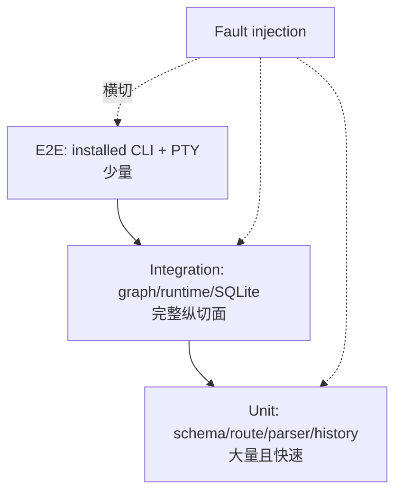

一个工具闭环测试不要只断言最终答案。下面是项目级 test helper 风格的伪代码；完整可运行版本见
10.9 的 `test_model_tool_model_observation_loop`：

```python
async def test_model_tool_model_loop(tmp_path):
    model = ScriptedModel([
        completed(tool_call("c1", "add", {"a": 20, "b": 22})),
        completed(assistant("42")),
    ])
    tool = RecordingArgumentsTool()
    runtime = make_runtime(tmp_path, model=model, tools=[tool])

    events = await collect(runtime.stream("20+22?"))

    assert tool.calls == [{"a": 20, "b": 22}]
    assert isinstance(model.requests[1].items[-1], ToolResultItem)
    assert model.requests[1].items[-1].content == "42"
    assert isinstance(events[-1], TurnCompleted)
```

它同时证明 Action 执行、Observation 召回、第二次采样和终态。真实模型可能变化且收费，只用于显式
online smoke test，不能成为核心回归基线。

### 10.12 故障注入方法

用 repository decorator 在 durable commit 后抛异常：

```python
class FailOnceAfterModelCommit(SessionRepository):
    async def commit_model_step(self, *args):
        await self.inner.commit_model_step(*args)
        if not self.failed:
            self.failed = True
            raise InjectedCrash("after durable model commit")
```

第一个 Runtime 完全关闭后，第二个 Runtime 使用相同 DB 恢复。不要复用第一个进程的内存对象，否则
测试没有证明跨进程语义。

### 10.13 完成定义

“代码运行了”与“完整 Harness”不是同一个验收层级。按下面三层收口，可以避免把教学 demo 的能力
宣传成生产系统，也能让每个 Milestone 有明确终点。

| 层级 | 必须具备 | 证据与当前状态 |
| --- | --- | --- |
| 教学 MVP | canonical item；ScriptedModel；严格 tool schema；六节点 ReAct；Observation 回灌；step/call 上限；typed terminal event；资源关闭 | 10.9 单文件与三个离线测试 |
| 可工作的核心五组件版 | 可验证 plan snapshot；同 Thread history；至少一种跨 Thread Memory；候选 ToolSpec 与执行隔离；每 Step Context 重建和预算；真实 Provider；业务账本 + checkpoint 恢复 | 第 2–6 章给出设计与当前 Corki 源码证据；7.5 证明五组件 composition；3.11、8.8、10.10 分别证明最小 Memory、Provider 协议和恢复语义 |
| 生产增强版 | 精确/保守 token 策略；安全 compaction；tool side-effect policy；backpressure；进程树取消；retry/error taxonomy；lease/并发 owner；sandbox/审批；扩展故障隔离；可观测性 | Corki 源码与 Unit/Integration/Recovery/PTY E2E 测试；不由 10.9 示例单独证明 |

教学 MVP 的完成清单：

- 模型可根据 Observation 进入第二个 Step，并由确定性 evaluation 终止；
- 错误 schema、未知/未曝光工具、重复 call ID、step/call 超限都成为可测试结果；
- 每个 Turn 恰有一个 completed/failed/cancelled 终态，模型资源能关闭；
- 所有核心回归使用 ScriptedModel，不需要 API key。

核心五组件版的完成清单：

- plan、provider reasoning 与程序 route 是三种不同数据，plan snapshot 通过 schema 与单 active-step 约束；
- canonical history 与 provider wire 解耦，Context 每 Step 刷新且计算 tools/attachments 在内的完整预算；
- Tool 的候选形成、模型选择、frozen-step 校验、执行、Observation 回灌和结果截断完整；
- Memory 同时覆盖当前工作状态、同 Thread 历史和一种可追溯的跨 Thread 召回；
- model step 与 tool call 有稳定幂等键，第二个全新 Runtime 能从注入故障中恢复；
- 至少一个真实 Provider + 安全只读工具通过显式 online smoke test，离线 mock 覆盖所声明的协议分支。

生产增强版还必须证明：

- 事件队列有 backpressure，取消会清理所有 Task、HTTP stream 与子进程树；
- 若允许并发更新 plan，步骤有稳定 ID，revision/CAS 或 transition validator 能拒绝 stale update；
- 有副作用的工具使用远端 idempotency key、人工确认或补偿策略，不虚构 exactly-once；
- 压缩不丢当前输入、不拆 call/result；外部内容污染不会进入长期记忆；
- 可选 memory/MCP/plugin 失败不破坏基本 Turn，关闭顺序可重复且聚合错误；
- Unit、Integration、Recovery、installed CLI + PTY E2E 覆盖各自声明的范围。

完成核心五组件版以后再加入 sandbox、审批、多 Agent、显式 ToT 或向量 Tool Retriever；它们应扩展
port、状态与策略，不应推翻五组件核心。

---

## 十一、总结与源码阅读地图

### 11.1 五个核心问题

实现 Harness 时依次问：

1. **Planning & Reasoning**：模型怎样提出行动，程序怎样校验计划与路由，Observation 怎样触发调整？
2. **Memory**：哪些信息属于短期、工作、长期记忆，谁保存，谁召回，何时失效？
3. **Tool Use**：候选能力怎样形成，模型怎样选择，执行前如何验证，结果如何回到下一 Step？
4. **Context Engineering**：本次请求究竟看见什么，顺序、角色、来源和 token 预算是什么？
5. **State Management**：节点、边、循环和并行怎样被状态驱动，任意两行间崩溃后如何恢复？

### 11.2 推荐源码阅读顺序

| 顺序 | 源码 | 要回答的问题 |
| --- | --- | --- |
| 1 | [`protocol/items.py`](src/corki/protocol/items.py)、[`tools.py`](src/corki/protocol/tools.py) | 五组件交换哪些 canonical 事实？ |
| 2 | [`core/state.py`](src/corki/core/state.py) | 工作记忆包含什么？ |
| 3 | [`core/graph.py`](src/corki/core/graph.py) | 六节点怎样形成 ReAct 循环？ |
| 4 | [`evaluation/guards.py`](src/corki/evaluation/guards.py) | 路由怎样保持确定？ |
| 5 | [`tools/registry.py`](src/corki/tools/registry.py)、[`executor.py`](src/corki/tools/executor.py) | 工具怎样曝光、校验和执行？ |
| 6 | [`context/builder.py`](src/corki/context/builder.py)、[`window.py`](src/corki/context/window.py) | 请求怎样构造和压缩？ |
| 7 | [`core/runtime.py`](src/corki/core/runtime.py) | 谁拥有图、事件、取消和资源？ |
| 8 | [`storage/sqlite.py`](src/corki/storage/sqlite.py) | 业务事实怎样幂等持久化？ |
| 9 | [`models/openai_compatible.py`](src/corki/models/openai_compatible.py)、[`responses.py`](src/corki/models/responses.py) | 外部流怎样变 canonical？ |
| 10 | [`memory/pipeline.py`](src/corki/memory/pipeline.py) | 跨 Thread 经验怎样治理？ |
| 11 | `skills/`、`mcp/`、`plugins/` | 扩展怎样复用 Context/Tool 入口？ |

### 11.3 源码与测试配对阅读

| 主题 | 测试 |
| --- | --- |
| 工具闭环 | [`test_agent_tool_loop.py`](tests/integration/test_agent_tool_loop.py) |
| Context 与工具召回 | [`test_context_and_tool_recall.py`](tests/integration/test_context_and_tool_recall.py) |
| 恢复与并发 | [`test_recovery_and_concurrency.py`](tests/integration/test_recovery_and_concurrency.py) |
| 压缩窗口 | [`test_window.py`](tests/unit/context/test_window.py) |
| Provider 可靠性 | [`test_transport_reliability.py`](tests/unit/models/test_transport_reliability.py) |
| 长期记忆 | [`test_long_term_memory.py`](tests/integration/test_long_term_memory.py) |
| Skills/MCP/Plugin | 对应 `tests/unit/skills`、`mcp`、`plugins` |

先预测测试应该断言什么，再读测试；先解释为什么某个故障必须失败，再运行它。只顺着 happy path 源码
阅读，很难看见 Harness 真正的工程价值。

五个核心组件最终形成同一个闭环：Context 给模型一个受预算的世界，Planning & Reasoning 选择下一
Action，Tool Use 产生真实 Observation，Memory 保存可复用事实，State Management 让这一切在循环、
并发、取消和崩溃中仍然可解释。当你能独立实现并测试这个闭环，你写的才不只是聊天 API，而是一个
Agent Harness。
